## Overview

- Study land use & climate mitigation relationship by combining Vulcan 1-km gridded fossil fuel CO2 (FFCO2) \& EPA Smart Location Database land use features
- Partition emissions into transportation, residential energy, & scope 2 residential electricity
- Perform doubly robust inference using continuous propensity scores & BART outcome regression

## Motivation

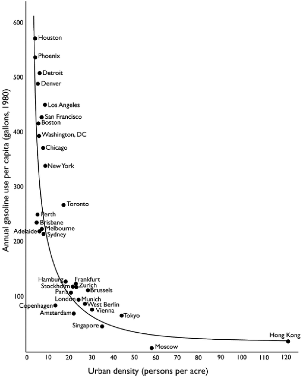{fig-align="center"}

## Literature{.smaller}
- **Urban economics:** Glaeser & Kahn (2008) used an ad-hoc CO2 estimation strategy to compare 66 metropolitan areas​
    - Lowest CO2 rates in California​
    - Highest CO2 rates in Texas & Oklahoma​
    - Development restrictions push new development into high CO2 regions​
- **Urban planning:** Kockelman (1997) + Cervero & Ewing (2010) examine 3/5Ds of land use​
    - Density, Diversity, Design, Destination Access, & Distance to Transit​
- **Urban science:** Fragkias et al. (2013) used earlier version of Vulcan CO2 dataset (1999-2008) to study urban scaling in total CO2​
    - Found proportional scaling of 0.95% increased CO2 per 1% increase in population – i.e., larger cities not significantly more efficient

## Model Development Process
```{mermaid}
flowchart LR
  classDef big font-size:36px,fill:#9CD97A,stroke:#11AB67,color:#000000;

  A["Input<br/>FFCO2 by<br/>sector"] --> 
  B["Add climate<br/>and 5D land<br/>use data"] -->

  C["Correlation<br/>analysis to<br/>identify<br/>redundant<br/>variables<br/>for GPS"] -->

  D["Confounder<br/>analysis<br/>DAGs using<br/>Strata‑sum<br/>importance"] -->

  E["Test GPS<br/>functions<br/>GLM, BART,<br/>etc."] -->

  F["Doubly<br/>robust<br/>outcome<br/>model<br/>BART"] -->

  G["Outcome<br/>models<br/>for 5D<br/>treatments<br/>linear<br/>regression"]

  class A,B,C,D,E,F,G big;
```

## Confounder Identification
::: {.columns}
::: {.column width="50%"}
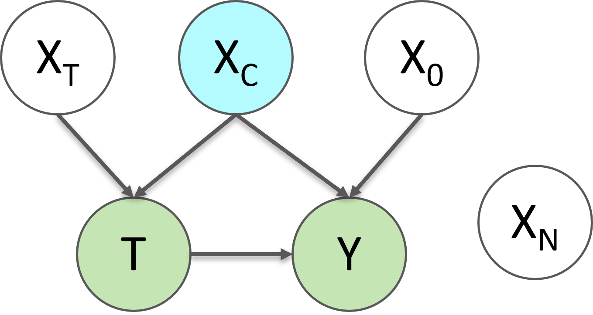{fig-align="center"}
:::

::: {.column width="50%"}
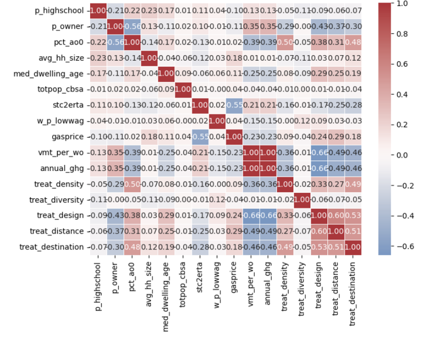{fig-align="center"}
:::
:::

## Conditional Variable Importance

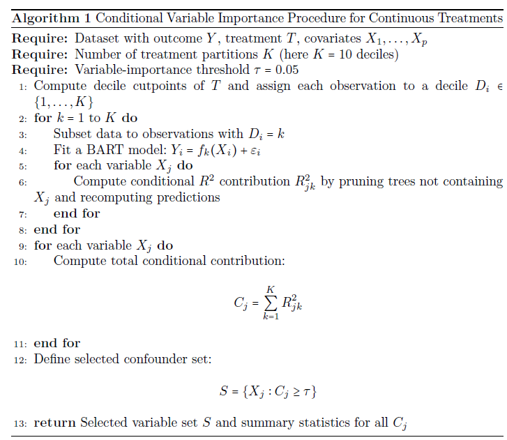{fig-align="center"}

## Doubly Robust Outcome Model
### BART Outcome Model
$$\begin{split}
\ln(CO_2 \text{ per capita}) =& \text{ln(total CBSA population)} \\&+ \text{ln(CBSA population density)} \\&+ \text{ln(average CBG treatment level in CBSA)} \\&+ \text{propensity score} \\&+ \text{CBSA fixed effect}
\end{split}$$

### Doubly Robust Adjustment using BART \& Continuous GPS

$$\hat{\mu}_{i}^{DR}(t) = m(t,X_i) + w_i(t)\left\{Y_i - m(T_i,X_i)\right\}$$

## Individual Transportation Results
- **Note:** results are production-based, meaning allocated to the point of emissions not trip origin
<!-- 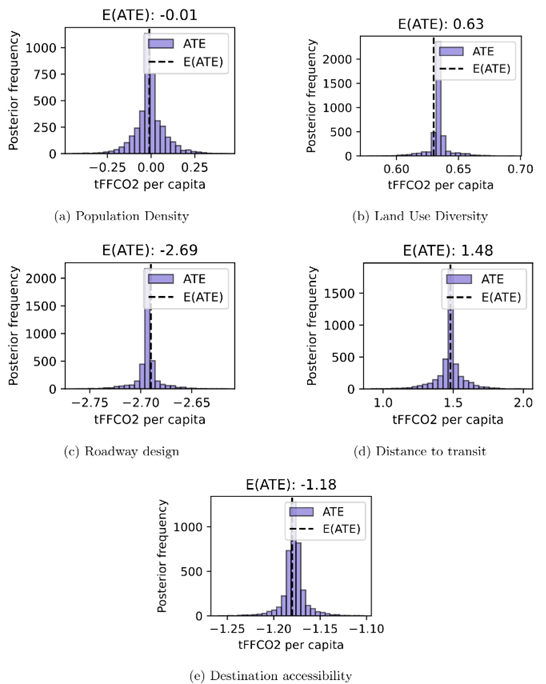{fig-align="center" width="35%"} -->

::: {.content-visible when-format="revealjs"}
```{=html}
<div style="display: grid; grid-template-columns: repeat(3, 1fr); gap: 6px; justify-items: center;">
  <figure style="margin: 0;">
    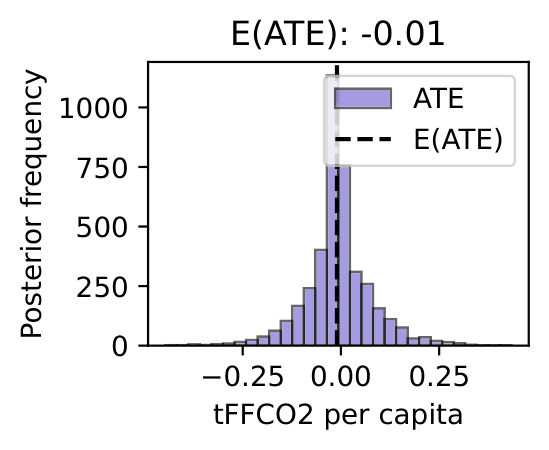
    <figcaption style="margin: 2px 0 0 0; font-size: 0.8em;">Density</figcaption>
  </figure>
  <figure style="margin: 0;">
    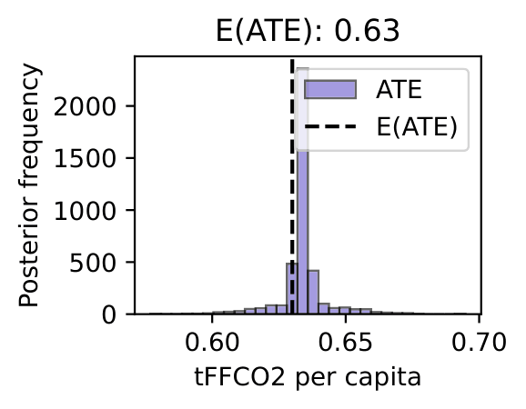
    <figcaption style="margin: 2px 0 0 0; font-size: 0.8em;">Diversity</figcaption>
  </figure>
  <figure style="margin: 0;">
    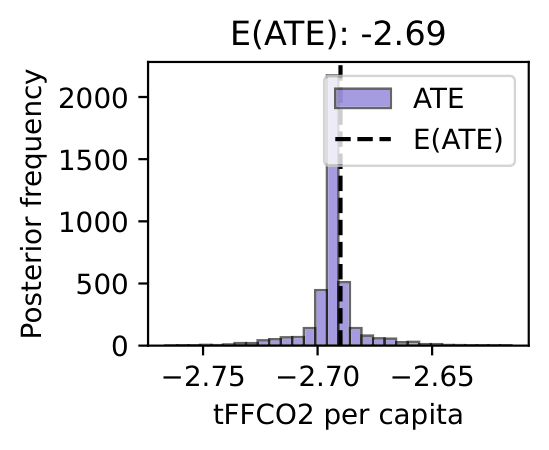
    <figcaption style="margin: 2px 0 0 0; font-size: 0.8em;">Design</figcaption>
  </figure>
  <figure style="margin: 0;">
    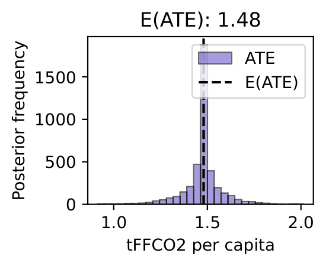
    <figcaption style="margin: 2px 0 0 0; font-size: 0.8em;">Distance</figcaption>
  </figure>
  <figure style="margin: 0;">
    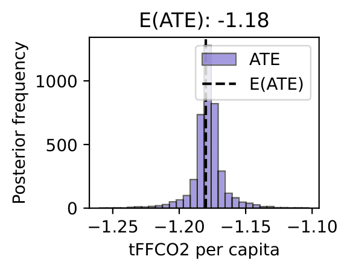
    <figcaption style="margin: 2px 0 0 0; font-size: 0.8em;">Destination</figcaption>
  </figure>
</div>
```
:::

## Joint Transportation Results
- Various joint treatment models estimated with metro/local treatments, propensity score adjustment, & spatial parameters

| Variable        | Base OLS   | Spatial EV | SEM + SLX(10km)   |
|---------------|--------|-----------------|--------|
| Local density | -0.187***   | -0.187***        | -0.194*** |
| Roadway design | -0.449*** | -0.449***        | -0.475***    |
| Transit distance | -0.001    | -0.001         | +0.067***   |
| W Transit distance | --    | --         | -0.144***   |
| Residual Moran's I | 0.370    | 0.368         | 0.174   |

## Individual Residential Electricity Results
::: {layout-ncol=2}
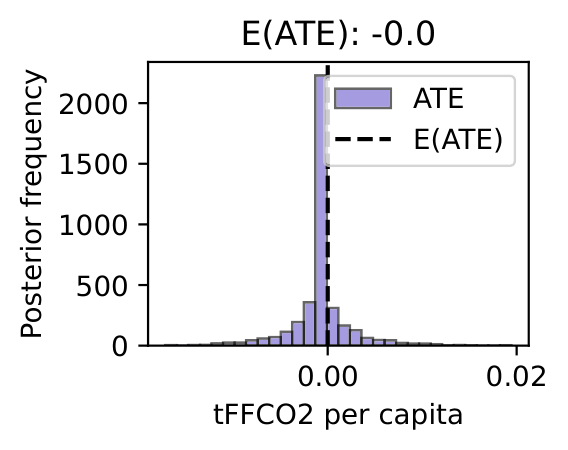{height="300px" fig-align="center"}

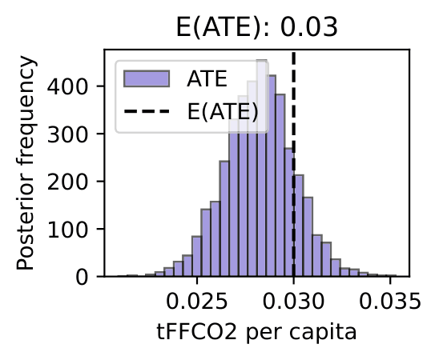{height="300px" fig-align="center"}

:::

## Joint Residential Electricity Results
- Various joint treatment models estimated with metro/local treatments, propensity score adjustment, & spatial parameters

| Variable        | Base OLS   | Spatial EV |
|---------------|--------|-----------------|
| Local density | -0.068***   | -0.068***        |
| Local diversity | +0.037*** | +0.037***        |
| Local diversity $\times$ PS | -0.035***    | -0.035***         | 
| Residual Moran's I | 0.648    | 0.648         |

## Individual Residential Energy Results
::: {layout-ncol=2}
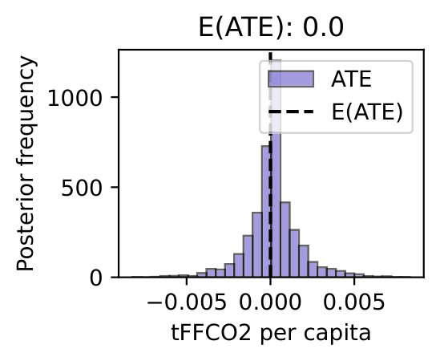{height="300px" fig-align="center"}

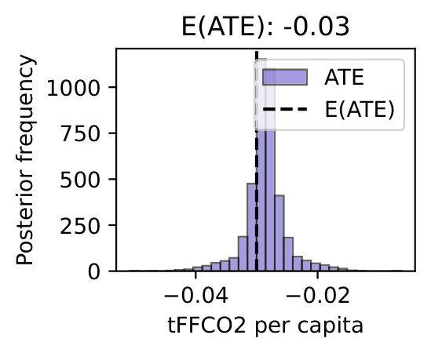{height="300px" fig-align="center"}

:::

## Joint Residential Energy Results
- Various joint treatment models estimated with metro/local treatments, propensity score adjustment, & spatial parameters

| Variable        | Base OLS   | Spatial EV |
|---------------|--------|-----------------|
| Local density | -0.120***   | -0.120***        |
| Local diversity | +0.008*** | +0.008***        |
| Local diversity $\times$ PS | +0.010***    | +0.010***         | 
| Residual Moran's I | 0.431    | 0.431         |

## Overall Results
- Production- and consumption-based emissions allocations tell fundamentally different stories: for production-based transportatation FFCO2, higher density lowers emissions but higher land use mix/destination access raises them
- Residential emissions results are mixed: density lowers both sources but other results vary
- Roadway network density has a consistently negative effect on transportation FFCO2 emissions

## Discussion
- **Congestion pricing/low-emission zones** address external cost on local results from production-based transportation emissions
- Compact development reduces residential emissions
- Regional 5D averages have minimal effects on sector-specific emissions after controlling for local 5D effects

## Future work
- Develop consumption(home)-based transportation emissions estimates based on OD flows
- Extension to other criteria air pollutants
- Spatial scaling analysis by city & climatic zone for population & 5D metrics

## Thank you

Questions? Reach out any time.

[jfhawkin@ucalgary.ca](mailto:jfhawkin@ucalgary.ca)

Presentation \& paper available:

{fig-align="center"}
