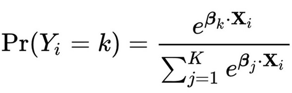

Choice modelling is a core method in our research. We develop discrete and discrete-continuous econometric demand models of choice driven by the needs of our empirical work. We focus on behaviour mechanisms through econometric and Bayesian statistical methods, with some dabbling in algorithmic methods through collaborations with excellent research partners. We are interested in the general areas of behavioural decision-rule heterogeneity and collective decision processes. This research stream includes work on stated preference techiques to better capture behavioural dynamics and address hypothetical biases.

## Related Publications

:::{#pubs}
:::