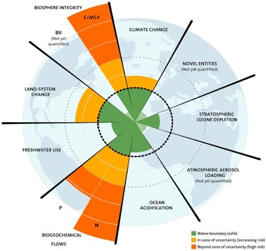

The human economy exists within broader social and ecological environments. While neoclassical environmental economics assumes *weak sustainabilty* through the assumption that natural capital is fully substitutible by human and manufactured capital, we advance the *strong sustainability* definition that natural capital is a finite resource and is only partially substitutable. Drawing on engineering and natural scientific knowledge, we advance theory, methods, and empirical study of household behaviour through an ecological economics lens. Our theoretical work explores non-capitalist political economy, environmental ethics, climate science, and thermodynamics. Empirical applications use a combination of choice econometrics and network science to understand the constraints and interdepencies of human-ecological systems.

## Related Publications

:::{#pubs}
:::