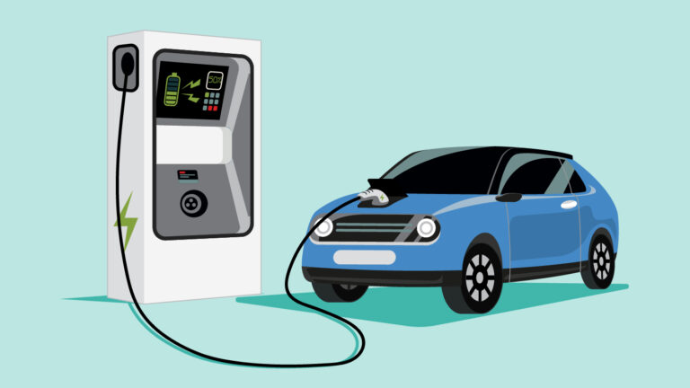

Vehicle adoption is the study of household and firm decisions regarding the purchase and use of various classes of vehicles. Our interest is the adoption of sustainable travel modes that meet travel needs, while reducing associated environmental impacts. We use a combination of surveys, choice modeling, and data analysis to understand the drivers of vehicle adoption. Our research spans behavioural demand and market policy analysis, drawing on expertise from engineering, economics, and public policy.

## Related Publications

:::{#pubs}
:::