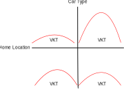
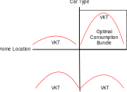
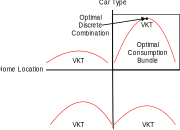

## Outline

1.  Microeconomic theory of demand
2.  Quantitative analysis of consumer demand
    a.  Concept of utility
    b.  Direct/indirect utility
    c.  Demand function
    d.  Functional forms of demand function

# Introduction

## Microeconomics {.smaller}

-   Branch of economics dealing with **behaviour** of **economic agents** including:​
    -   Consumers​
    -   Labour force (workers)​
    -   Firms​
    -   Investors​
    -   Markets: Interactions among all of the above​
-   Demand-Supply:​
    -   **Demand function** representing behavior of users/agents​
    -   **Supply function** representing level-of-service, congestion, & behavior of service providers​
    -   **Market clearance** = demand & supply equilibrium​

## Demand-Supply Relationship

-   Short-term demand-supply: Ex. Roadway link at an instant​
-   Long-term demand-supply: Ex. Residential housing​
-   Equilibrium

{fig-align="center" width="50%"}


## Shifting Curves

{fig-align="center" width="50%"}

## Comparative Statics
- Create a model of market behavior:​
  - Explain consumer & firm choices as functions of exogenous variables – e.g., income & government policy​
- Develop scenarios​
  - Changes in exogeneous variables​
- Derive changes in the endogenous variables 

## Comparative Statics Example​
- The market for taxi service:​
  - Supply function: QS = – 125 + 125P​
  - Demand function: QD = 1000 – 100P​
  - Where does the market clear?​
- What happens if demand shifts such that now QD = 1450 – 100P?​

## Comparative Statics Example - SOLUTION
{fig-align="center" width="50%"}

## Concept of Utility​
- Utility: a measure of benefit or attractiveness of alternative courses of action​
  - Assumption that people choose action that maximizes utility (profit) and minimizes disutility (cost)​
- An abstract/latent concept that gives only ordinal ranking:​
  - No inherent meaning​
  - No generic unique function​
  - Unaffected by monotonic transformation​
- Utility measures:​
  - Direct utility: f(quantity of consumption)​
  - Indirect utility: f(utility of consumption)​

## Consumption Set: Bundle of Choices​
- Derive demand function based on concept of utility maximization subject to budget and constraints​
- Consumption set [X]: a possible bundle of choices (goods: real or virtual)​
- Consumer has preferences over the consumption set​
- Properties of a consumption bundle (of the mathematical function defining bundle):​
  - Complete, reflexive, transitive, continuous, and convex​

## Properties of a Consumption Bundle​

## Utility Function & Consumption Set


## Utility Function: Diminishing Marginal Utility of Consumption

## Consumption Demand​

## Demand Functions​

## Marshallian Demand Function​

## Definition of Goods​

## Definition of Goods

## Hicksian Demand Function​

## Marshallian & Hicksian Demand​

## Direct Utility Maximization​

## Direct Utility Maximization​

## Indifference Curves​

## Marginal Rate of Substitution (MRS)​

## Envelope Theorem​

## Marginal Utility of Income (Application of Envelope Theorem)​

## Indirect Utility Function​

## Indirect Utility and Demand​

## Properties of Indirect Utility Function​

## Roy’s Identity (Another Application of Envelope Theorem)​

# Continuous Demand​
## Functional Forms for Demand/Production/Expenditure​

## Cobb-Douglas Direct Utility Function​

## Cobb-Douglas Direct Utility Function​

## Cobb-Douglas Direct Utility Function​

## Elasticity of Substitution​

## Cobb-Douglas Utility Function​

## Cobb-Douglas Utility Function​

## Roy’s Identity & Cobb-Douglas Function​

## Constant Elasticity of Substitution (CES) Direct Utility Function​
- General specification: $U = \left(\sum_i \alpha_i q_i^{\rho}\right)^{1/\rho}$
- For an example with two alternatives: $U = \left(\alpha_1 q_1^{\rho} + \alpha_2 q_2^{\rho} \right)^{1/\rho}$
- A flexible function that can represent various forms of indifference curves (demand functions) based on the value of $\rho$

## CES Direct Utility Function​
$MRS = - \frac{\alpha_1}{\alpha_2}\left(\frac{q_2}{q_1}\right)^{\rho-1}$

- Elasticity of subsitution
$ln(|MRS|) = ln\left(\frac{\alpha_1}{\alpha_2}\right) + (\rho-1)ln\left(\frac{q_2}{q_1}\right)$

$ln\left(\frac{q_2}{q_1}\right) = \frac{1}{\rho-1}ln(|MRS|) + \frac{1}{\rho-1}ln\left(\frac{\alpha_2}{\alpha_1}\right)$

$\sigma = \frac{d ln\left(\frac{q_2}{q_1}\right)}{d ln(|MRS|)} = \frac{1}{\rho-1}$

## CES Direct Utility Maximization​
- Consier a simple two alternative example
$U = (\alpha_1 q_1^{\rho} + \alpha_2 q_2^{\rho})^{\frac{1}/{\rho}}$

- Using Lagrangian function and FOC for $q_1$ and $q_2$
$q_1 = q_2(\frac{p_1/\alpha_1}{p_2/\alpha_2})^{\frac{1}{\rho-1}}$ & $q_2 = q_1(\frac{p_2/\alpha_2}{p_1/\alpha_1})^{\frac{1}{\rho-1}}$

- Substituting either result into the budget constraint, optimal demands are
$q_1^* = \frac{I(p_1/\alpha_1)^{\frac{1}{\rho-1}}}{p_1(\frac{p_1}{\alpha_1})^{\frac{1}{\rho-1}}+p_2(\frac{p_2}{\alpha_2})^{\frac{1}{\rho-1}}}$ & $q_2^* = \frac{I(p_2/\alpha_2)^{\frac{1}{\rho-1}}}{p_1(\frac{p_1}{\alpha_1})^{\frac{1}{\rho-1}}+p_2(\frac{p_2}{\alpha_2})^{\frac{1}{\rho-1}}}$

## CES Indirect Utility Maximization​
- For general case, optimal demand is

$q_j^* = \frac{I(p_j/\alpha_j)^{\frac{1}{\rho-1}}}{\sum_k p_k (\frac{p_k}{\alpha_k})^{\frac{1}{\rho-1}}}$

- Indirect utility function at optimal direct utility level
$V = \left(\sum_k \alpha_k \left(\frac{I(\frac{p_k}{\alpha_k})^{\frac{1}{\rho-1}}}{\sum_k p_k (\frac{p_k}{\alpha_k})^{\frac{1}{\rho-1}}}\right)^{\rho}\right)^{\frac{1}{\rho}} = \frac{I}{\sum_k p_k (\frac{p_k}{\alpha_k})^{\frac{1}{\rho-1}}}\left(\sum_k(\alpha_k^{\frac{1}{\rho}}(\frac{p_k}{\alpha_k})^{\frac{1}{\rho-1}})^{\rho}\right)^{\frac{1}{\rho}}$

## Translog Demand/Cost Function​
- **Translog** is a quadratic, logarithmic specification of an indirect utility function written in terms of **expenditure-normalized prices**
  - Normalizing each price by dividing by total expenditure (income) imposes homogeneity
- Logarithmic indirect utility (or cost) function is

$ln(V) = \alpha_0 + \sum_j \alpha_j ln(\frac{p_j}{I}) + \frac{1}{2}\sum_j\sum_k \beta_{jk} ln(\frac{p_j}{I}) ln(\frac{p_k}{I})$

- Optimum quantity demands are derived using a logarthmic version of Roy's Identity

## Almost Ideal Demand System (AIDS)​
- **AIDS** is a combination of **Cobb-Douglas** and **translog** demand functions, describing an expenditure function necessary to attain a specific utility level at a given price
- Typical form is

$ln(V) = \alpha_0 + \sum_j \alpha_j ln(p_j) + \frac{1}{2}\sum_j \alpha_j ln(p_j) + \frac{1}{2}\sum_j\sum_k \gamma_{jk} ln(p_j) ln(p_k) + \beta_o \prod_j p_k^{\beta_k}$

# Discrete Demand

## Microeconomic Theory of Discrete Goods​
The consumer

- Selects the quantities of continuous goods: $Q = (q_1,\dots,q_L)$
- Chooses an alternative in a discrete choice set $i = 1,\dots,j,\dots,J$
- Discrete decision vector $(y_1,\dots,y_J), y_j \in {0,1}, \sum_j y_j = 1$

Note

- In theory, an alternative describes the combination of all possible choices made by a consumer
- In practice, the choice set will be restricted for tractability

## Example​
Choices

- Home location: discrete choice
- Car type: discrete choice
- Number of km driven per year: continuous choice

{fig-align="center"}

## Utility Maximization​
$U(Q,y,\tilde{z}^Ty,\tilde{z}^T,\theta)$

- Q are quantities of continuous good
- y is the discrete choice
- $\tilde{z}$ are the K attributes of the J discrete alternatives
- $\tilde{z}y$ are the attributes of the chosen alternative
- $\theta$ is a vector of parameters

## Optimization Problem​
$\max_{Q,y} U(Q,y,\tilde{z}^Ty)$

Suject to

$p^T Q + c^T y \le I$

$\sum y_j = 1$

$y_j \in {0,1} \forall j$

Why is it impossible to derive a direct demand function?

## Solution to Optimization Problem​
- In a mixed integer programming problem, need to condition on the discrete variables to obtain continuous demand functions​
- Continuous demand functions can be differentiated to obtain optimality conditions​
- Various solution algorithms exist: genetic algorithm, branch and bound, etc.

## Solution to Optimization Problem​
{fig-align="center"}

## Solution to Optimization Problem​
{fig-align="center"}

## Solution to Optimization Problem​
{fig-align="center"}


# Application to Demand Analysis

## Demand Modelling: Application of Utility Theory​ {.smaller}
- Demand models are **descriptive**, not **prescriptive**​
- Observed (revealed or stated) demand used to develop demand models:​
  - Observed demand is optimal demand.​
  - Utility theory used to specify the demand model that is supposed to predict the observed (optimal) demand​
  - Observed information contains measurement (*epistemic*) and random (*aleatoric*) uncertainties, so probability theory must be used to specify a stochastic model​
- **Econometric model**: application of statistics to behavioral/economic data based on a sample of observations​

## Observing/Modelling Demands​ {.smaller}
- Measurement of demands are through specification of random variables​
- Type of demand measurement (variable) defines the nature of corresponding econometric model​
- Underlying theory of microeconomics allows for meaningful interpretation of model parameters and results​
- For example:​
  - Cobb-Douglas theory, CES, translog, AIDS are used in aggregate travel demand models​
  - CES indirect utility specification forms the basis for many discrete choice models (e.g., GEV models), time/resource allocation models, etc.​

## Observing Demands​
::::: columns
::: {.column width="75%"}
- Variable types/measurements of travel demand:​
  - Cardinal numbers or ordinal measurements​
  - Quantitative or qualitative​
  - Discrete, continuous, count, or ordinal
:::

::: {.column width="25%"}
{fig-align="center"}
:::
:::::

## Modelling Travel Demands​ {.smaller}
- **Data** (revealed/stated preferences): data **do not** provide answers themselves​
  - We need **models** and **visualizations** to give context and structure​
- Identify underling **theory** to specify model of interest​
- Two types of models:​
  - **Aggregate** demand models​
  - **Disaggregate** demand/choice models​
- In either case, application of econometric techniques is crucial to ensure **evidence-based analysis**​
- Estimation of appropriate model parameters is the critical roadblock!​


````{=html}
<!-- <!-- ## Poll

```{=html}
<div style='position: relative; padding-bottom: 56.25%; padding-top: 35px; height: 0; overflow: hidden;'><iframe sandbox='allow-scripts allow-same-origin allow-presentation' allowfullscreen='true' allowtransparency='true' frameborder='0' height='315' src='https://www.mentimeter.com/app/presentation/alxnj1zbqv62hn7y7ma58wnuyki8kvn2/embed' style='position: absolute; top: 0; left: 0; width: 100%; height: 100%;' width='420'></iframe></div>
``` -->
````