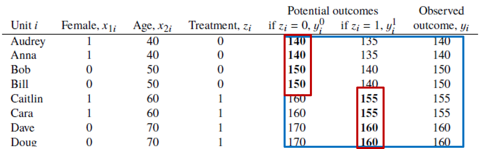
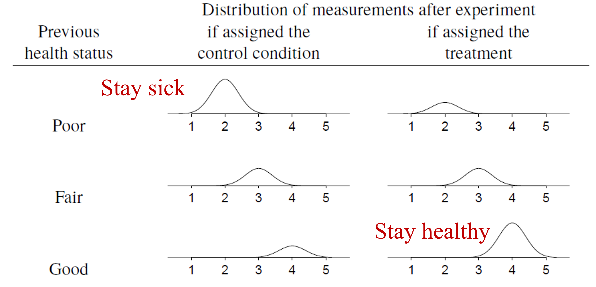

## Outline

::: incremental
1. Need for causal inference
2. Causal Graph Theory
:::

## Causal Inference in Transportation Planning
- Large-scale transportation models principally concerned with prediction
- However, increasingly interested in policy interventions & treatments

## Need for Causal Inference - Interpretation
- People are told to run around in a dark room for 5 minutes
- **Observation**: Men are found to have many more head injuries than women
- Conclusion: 
    - Women see better in the dark? 
    - Men are more reckless runners?

## Need for Causal Inference - Unobserved Heterogeneity
- Women who smoke have babies that are 600 grams under weight on average
- **Problem**: 
    - Is it due to smoking or unobserved factors that are correlated with smoking?

## Need for Causal Inference – Endogeneity & Self-Selection
- Cars with side impact airbags have lower injury severities when involved in crashes
- **Problem**: 
    - People owning side-impact airbags are not a **random sample** from the population (likely safer drivers)
    - Safter drivers expected to have lower injury severities

## Need for Causal Inference – Endogeneity & Self-Selection
- People who take motorcycle safety courses have higher crash rates
- **Problem**: 
    - Are courses ineffective?
    - People taking the course are not a random sample from the population (possibly less skilled)

## Causation = Potential Outcomes
- A key concept in causal inference is **potential outcomes**
- What happened vs. what could have happened (**counterfactual states**)
- We will work with several examples to illustrate the principles…

## Example: Omega-3 Fatty Acids {.smaller}
**Problem**: Does consumption of omega-3 fish oil supplements promote a healthy blood pressure?

**Experiment**: Eight friends agree to be part of an informal study on the relationship between fish oil supplements and systolic blood pressure. Four of the friends are placed in the “fish oil supplement” **treatment group**. Members of this group agree to consume 3 grams of fish oil supplements per day for one year while otherwise maintaining their current diets. The other four friends agreed to simply maintain their current diets free from fish oil supplements for the same year. At the end of the study period:

- Measure blood pressure
- Assume 160 mmHg and above represents “high blood pressure”

## Formal Problem Statement {.smaller}
$$𝑧 = 0 \text{; no fish oil supplement}$$
$$𝑧 = 1 \text{; fish oil supplement}$$

- Need to consider two cases:
    - Blood pressure given a person **did not** ingest any fish oil supplement $(y_i^0)$
    - Blood pressure given a person **did** ingest fish oil supplement $(y_i^1)$
- Only ever observe **one outcome per person** – no time machines!

## Formal Problem Statement
- Treatment given by $T_i = y_i^1 - y_i^0$
- **Fundamental problem of causal inference**: cannot observe both $y_i^1$ and $y_i^0$
- Can only estimate average causal effect across a sample (population)

## Close Substitutes
- What about using pre-study blood pressure as $𝑦_𝑖^0$?
    - Do not know if person made other changes over the year
- What about using post-study blood pressure as $𝑦_𝑖^0$?
    - Do not know if treatment has effect into year 2

## Average Treatment Effects {.smaller}
- Start with treatment and control groups
- Need sufficiently similar groups – balance
- Beware self-selection bias
{fig-align="center"}
- True average treatment effect = -7.5 mmHG
- Average treatment effect|treatment = +12.5 mmHG

## Causal Experiment Design
- **Randomized controlled trials** are “gold standard”
- **Almost never available** for transportation/social science research questions
- What to do?

## Adjustment for Pretreatment Variables
- Differences between treatment & control variables can be captured by including **pretreatment variables** in the model
- Addresses both random (**variance**) and systematic (**bias**) differences between treatment & control
- **Do not** adjust for posttreatment variables unless performing more complex analysis – e.g., instrumental variables (**IV**)

## Ignorability Condition
- **Ignorability in causal inference**: no imbalance between treatment & control, on average
- **Assignment to treatment** does not imply anything about potential outcome

# Causal Inference in Observational Studies

## Causal Inference in Observational Studies
- We rarely have access to a random controlled trial
- Observational causation is an exercise in logic & relative causal strength **NOT** causation

## Health Status Example
- Consider 100 patients receive a treatment and 1000 receive the control condition
- **Causal truth**: treatment has zero effect on health outcomes
- Suppose treatment and control groups **systematically differ**, with healthier patients receiving treatment

## Health Status Example
{fig-align="center"}

## Adding Predictors: Omitted Variables
- Simple solution is to compare treated and control units **conditional on previous health status**
- Health status is a **confounding variable** – affects both treatment & outcome
- If all confounding variable observed, then consistent causal treatment is possible

## Omitted Variable Bias {.smaller}
- Correct specification:
$$y_i = \beta_0 + \beta_1 𝑧_𝑖 + \beta_2 x_i + \epsilon_𝑖$$
- where $𝑧_𝑖$ is the treatment and $𝑥_𝑖$ is the covariate for unit $i$
- If $𝑥_𝑖$ is ignored then:
$$𝑦_𝑖=\beta_0^∗+\beta_1^∗ 𝑧_𝑖+\epsilon_𝑖^∗$$
- Using $𝑥_𝑖=\gamma_0+\gamma_1 𝑧_𝑖+𝜈_𝑖$:
$$𝑦_𝑖=\beta_0+\beta_2 \gamma_1+(\beta_1+\beta_2 \gamma_1 ) 𝑧_𝑖+\epsilon_𝑖+\beta_2 𝜈_𝑖$$
- Then:
$$\beta_1^∗=\beta_1+\beta_2 \gamma_1 \text{; }\gamma_1=0 \text{ denotes a non-confounding variable}$$

## Ignorability in Observational Studies {.smaller}
- **Strict ignorability** says distribution of potential outcomes same across treatment levels:
$$𝑦^0,𝑦_1 \perp 𝑧$$
- Conditional ignorability says the distribution of potential outcomes across treatment levels is the same, conditional on the covariates, $x$:
$$𝑦^0,𝑦_1 \perp 𝑧|𝑥$$
- Must make “leap of faith” that we have conditioned on all necessary confounding variables – **selection on observables** in econometrics literature

## Common Support or Overlap
{fig-align="center"}

# Quick Overview of Causal Graph Theory

## Causal Graph Theory
- Another perspective on causal inference from computer science – Judea Pearl et al.
- Abstract causal inference to a visual/graphical depiction
- Develop system of symbolic calculus
- Nonparametrically solve identification problem
- Concept of directed acyclic graphs (DAGs)

## Causal Graph Theory
- **English**: Smoking (X), Cancer (Y), Tar (Z), Genotypes(U)
- Directed acyclic graph (DAG)

{fig-align="center" width="40%"}