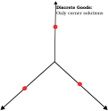
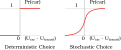

## Demand Versus Choice
::::: columns
::: {.column width="50%"}
**Demand**

- Aggregate
- Homogenous people
- Identical behaviour 
- **Variables:** Price (P) and quantity (Q)
- **Demand function:** Q = f(P)
- Demand = Bundle of choices
:::
::: {.column width="50%"}
**Choice**

- Disaggregate
- Heterogeneous people
- Random behaviour
- **Variables:** Attributes of choice alternatives; attributes of choice maker; context of choices
- Non-linear choice function
:::
:::::

## Transportation Choices
Many travel demand related choices are:

- **Discrete:** activity type choice, mode choice, route choice, vehicle type choice, time of the day choice, location of trip destination choice etc.
- **Continuous:** activity duration, vehicle usage, housing duration, etc.
- **Heterogeneous:** Wide variations of choices across the population.
- **Probabilistic/stochastic/random:** We can’t defined deterministically. 

## Choice as Consumption
{.absolute top="100" left="0"}

{.absolute top="100" right="0"}

## Choice as Consumption
**Disaggregate to Aggregate**

- Choice of private vehicle as mode -> # of vehicle trips
- Choice of transit as mode -> # of transit trips
- Choice of shared vehicle as mode -> # of shared vehicle trips

## Theory of Choice Behaviour
- **Descriptive (or positive):** how human beings behave, not how they should/ought to behave
- **Abstract:** that can be formalized in general cases not specific to particular circumstances
- **Operational:** can be applied to develop models with variables and parameters that can be observed and estimated. Models can be used for prediction and/or policy evaluation

## Framework of Choice Theory {.smaller}
- Choice as outcome of sequential decision-making:
  1. Definition of the choice problem
  2. Generation of alternatives
  3. Evaluation of attributes of alternatives
  4. Choice making
  5. Executing the choice
- Define:
  - Decision maker
  - Characteristics of decision maker
  - Alternatives
  - Attributes of alternatives
  - Decision rules to make choice

## Decision Maker {.smaller}
- **Disaggregate:** Individual or group (household, family, firms, government agency, etc.)
- **Heterogeneous choice makers:** Wide variety in choice behaviour across the population
  - Taste variations across the choice/decision makers: **Idiosyncrasy**
  - Different choice situations for different people
- **Characteristics of heterogeneous choice maker:** age, gender, income, education, household/firm size, etc.
- **Choice situations/context:** spatial, temporal, economic

## Alternatives {.smaller}
- **Choice** means choosing an alternative out of a choice set (*mutually exclusive and collectively exhaustive countable set of alternatives*):
- Universal choice set: $C$
- Feasible / Individual-specific: $C_i$
- Consideration (awareness) set: $C_{ci}$

**Example:**

$C$ = { Private car, Ridehail, Taxi, Bus, Bicycle, Walk}

- No driver’s license, distance > 3 km

$C_i$ = { Ridehail, Taxi, Bus, Bicycle}

- No driver’s license, distance > 3 km & not aware of Ridehail

$C_{ci}$ = { Taxi, Bus, Bicycle}

## Alternatives - Attributes
- Decision maker **evaluates alternatives** in terms of attribute values: Attribute values can be measured on the scale of attractiveness:
- **Categorical:** Binary, ordinal (reliability, safety, convenience, etc.)
- **Cardinal:** absolute values (time, cost, etc.)
- **Generic** versus **alternative-specific**
- **Measured** versus **perceived**

## Decision Rules
- **Rational behaviour (homo economicus):** self-interested economic actor who optimizes own choice outcomes
- **Bounded rationality:** Use rules to simplify:
  - **Dominance:** Rules used to remove inferior alternative
  - **Satisfaction:** Attributes of the alternatives need to satisfy the expectation level
  - **Lexicographic:** attributes are rank ordered by their level of importance
  - **Utility maximizing:** maximize a latent function of different attributes of alternatives in the choice set

## Utility Maximization {.smaller}
**Utility function:**

- Captures **relative attractiveness** of alternative in the choice set
- Measures the satisfaction that the decision maker wants to optimize

**Assumptions:**

- Decision maker has **full knowledge** about the attributes of the alternatives and is able to process information
- Base on information processing, decision maker **associates a utility** to each alternative
- Decision maker has **transitive preferences**
- Decision maker is **rational** and **perfect optimizer**
- Decision maker is **consistent**

## Probability in Utility Maximization {.smaller}
::::: columns
::: {.column width="50%"}
**Constant utility:** 

- Utility is **deterministic** and **cardinal** in nature
- Decision maker **does not** maximize utility 
- However, human behaviour is inherently random
:::
::: {.column width="40%"}
**Random utility:**

- Decision maker is a **rational optimizer**
- Modeller **does not** observe the exact measure of utility used by the decision maker
- Utility becomes **random** and **ordinal** variable
- Probabilistic choice model because of **unobserved heterogeneity** (randomness)
:::
:::::

## Discrete Choice {.smaller}
**Two alternatives:** transit, car
$$𝑈_{𝑡𝑟𝑎𝑛𝑠𝑖𝑡}=\beta_𝑡 𝑇𝑖𝑚𝑒_{𝑡𝑟𝑎𝑛𝑠𝑖𝑡}+\beta_𝑐 𝐶𝑜𝑠𝑡_{𝑡𝑟𝑎𝑛𝑠𝑖𝑡} \text{ (Typically, }\beta_t, \beta_c <0)$$

$$𝑈_{𝑐𝑎𝑟}=\beta_𝑡 𝑇𝑖𝑚𝑒_{𝑐𝑎𝑟}+\beta_𝑐 𝐶𝑜𝑠𝑡_{𝑐𝑎𝑟}$$

Equivalent specification
$$𝑈_{𝑡𝑟𝑎𝑛𝑠𝑖𝑡}=(\beta_𝑡/\beta_𝑐)𝑇𝑖𝑚𝑒_{𝑡𝑟𝑎𝑛𝑠𝑖𝑡}+𝐶𝑜𝑠𝑡_{𝑡𝑟𝑎𝑛𝑠𝑖𝑡}$$

$$𝑈_{𝑐𝑎𝑟}=(\beta_𝑡/\beta_𝑐)𝑇𝑖𝑚𝑒_{𝑐𝑎𝑟}+𝐶𝑜𝑠𝑡_{𝑐𝑎𝑟}
$$

**Choice:** car, if
$$\beta_𝑡 𝑇𝑖𝑚𝑒_{𝑐𝑎𝑟}+\beta_𝑐 𝐶𝑜𝑠𝑡_{𝑐𝑎𝑟} \geq \beta_𝑡 𝑇𝑖𝑚𝑒_{𝑡𝑟𝑎𝑛𝑠𝑖𝑡} + \beta_𝑐 𝐶𝑜𝑠𝑡_{𝑡𝑟𝑎𝑛𝑠𝑖𝑡}
$$

or
$$(\beta_𝑡/\beta_𝑐)𝑇𝑖𝑚𝑒_{𝑐𝑎𝑟}+𝐶𝑜𝑠𝑡_{𝑐𝑎𝑟} \leq (\beta_𝑡/\beta_𝑐)𝑇𝑖𝑚𝑒_{𝑡𝑟𝑎𝑛𝑠𝑖𝑡}+𝐶𝑜𝑠𝑡_{𝑡𝑟𝑎𝑛𝑠𝑖𝑡}
$$

## Discrete Choice {.smaller}
Car is the **dominant alternative**, if
$$𝑇𝑖𝑚𝑒_{𝑐𝑎𝑟} < 𝑇𝑖𝑚𝑒_{𝑡𝑟𝑎𝑛𝑠𝑖𝑡} \text{ & } 𝐶𝑜𝑠𝑡_{𝑐𝑎𝑟} < 𝐶𝑜𝑠𝑡_{𝑡𝑟𝑎𝑛𝑠𝑖𝑡} \therefore 𝑈_{𝑐𝑎𝑟} > 𝑈_{𝑡𝑟𝑎𝑛𝑠𝑖𝑡}$$

Car and transit in competition, if
$$𝑇𝑖𝑚𝑒_{𝑐𝑎𝑟} < 𝑇𝑖𝑚𝑒_{𝑡𝑟𝑎𝑛𝑠𝑖𝑡} \text{ & } 𝐶𝑜𝑠𝑡_{𝑐𝑎𝑟} > 𝐶𝑜𝑠𝑡_{𝑡𝑟𝑎𝑛𝑠𝑖𝑡}$$

Is the traveler willing to pay extra $(Cost_{car}-Cost_{transit})$ to save $(Time_{transit} -Time_{car})$?

If yes (pick car): $\left(\frac{\beta_𝑡}{\beta_𝑐}\right)𝑇𝑖𝑚𝑒_{𝑐𝑎𝑟} + 𝐶𝑜𝑠𝑡_{𝑐𝑎𝑟} \leq \left(\frac{\beta_𝑡}{\beta_𝑐}\right)𝑇𝑖𝑚𝑒_{𝑡𝑟𝑎𝑛𝑠𝑖𝑡} + 𝐶𝑜𝑠𝑡_{𝑡𝑟𝑎𝑛𝑠𝑖𝑡}$

Willingness-to-pay or Value of Travel Time Savings (VOTS):
$$\left(\frac{\beta_𝑡}{\beta_𝑐}\right) \geq \frac{(𝐶𝑜𝑠𝑡_{𝑐𝑎𝑟}−𝐶𝑜𝑠𝑡_{𝑡𝑟𝑎𝑛𝑠𝑖𝑡})}{(𝑇𝑖𝑚𝑒_{𝑡𝑟𝑎𝑛𝑠𝑖𝑡}−𝑇𝑖𝑚𝑒_{𝑐𝑎𝑟})}$$

## Discrete Choice
{fig-align="center"}

## Discrete Choice
{fig-align="center"}

## Stochastic Discrete Choice {.smaller}
- Choice Probability of an alternative $j$ for an individual $i$ with choice set $C_i$
$$Pr⁡( 𝑗|𝐶_𝑖)=Pr⁡( 𝑈_{𝑖𝑗} \geq 𝑈_{𝑖𝑘}) \text{, } 𝑘 \neq 𝑗 \text{ & } 𝑘 \in 𝐶_𝑖$$

- Random utility:
$$𝑈_{𝑖𝑗}=𝑉_{𝑖𝑗}+\epsilon_{𝑖𝑗} \text{, } 𝑗 \in 𝐶_𝑖$$

- Random Utility Maximizing (RUM) Choice Model:
$$Pr⁡( 𝑗|𝐶_𝑖)=Pr⁡( 𝑉_{𝑖𝑗} + \epsilon_{𝑖𝑗} \ge 𝑉_{𝑖𝑘} + \epsilon_{𝑖𝑘}) \text{, } 𝑘 \neq 𝑗 \text{ & } 𝑘 \in 𝐶_𝑖$$
Or
$$Pr⁡( 𝑗|𝐶_𝑖)=Pr⁡( \epsilon_{ik} - \epsilon_{ij} \leq V_{ij} - V_{ik}) \text{, } 𝑘 \neq 𝑗 \text{ & } 𝑘 \in 𝐶_𝑖$$

## RUM-Based Discrete Choice {.smaller}
- **Fully specified** choice set $C_i$
- Attributes of alternatives are **completely defined**
- Only **differences in utility** matter
- **Systematic utility function** is specified as a function of attributes
- An attribute may have the **same** (generic) weighting factors (coefficient) for all alternatives **if it varies across the alternatives** (e.g., travel time, travel cost, etc.).
- An attribute may have **different** weighting factors (coefficient) for different alternatives if it **does not vary across the alternatives** (age, gender, income, etc.).
- Assumption on distribution of random utility is necessary to derive choice probability: **Stochastic Choice Model**

## Binary Discrete Choice {.smaller}
Choice Probability of an alternative $j$ for an individual $i$ with choice set $C_i$ of two alternatives: $j, k$ (dropping $i$ for sake of simplicity)
$$Pr⁡( 𝑗|𝐶_𝑖)=Pr⁡( 𝑉_𝑗+\epsilon_𝑗 \ge 𝑉_𝑘+\epsilon_𝑘)$$
$$Pr⁡( 𝑗|𝐶_𝑖)=Pr⁡( \epsilon_𝑘−\epsilon_𝑗≤𝑉_𝑗−𝑉_𝑘)$$
**Binary Probit:**

- $\epsilon_j,\epsilon_k$ are both **normally distributed**
- So,($\epsilon_k-\epsilon_j$) is also **normally distributed**
- With fully specified alternative specific constants, ($\epsilon_k-\epsilon_j$) is $N(0,\sigma^2)$:
$$V-j - V_k = \beta_0 + \sum \beta(x_j - x_k)$$
- **Resulting Choice model:** $Pr(j) = \Phi(V/\sigma)$
- $\sigma$ normalized to 1, giving **probit model** with unit variance

## Binary Discrete Choice {.smaller}
**Binary Logit:**

- $\epsilon_j,\epsilon_k$ are **IID Type I EV distributed** with scale $\mu$ and variance $\pi^2/6\mu^2$
- With fully specified alternative specific constants, ($\epsilon_k-\epsilon_j$) is **logistically distributed** with scale $\mu$ and variance $\pi^2/3\mu^2$:
 $$V_j - V_k = V = \beta_0 + \sum \beta (x_j - x_k)$$
Resulting Choice model:
$$Pr(j) = \frac{1}{1+\exp(-\mu(V_j - V_k))} = \frac{\exp(\mu V_j)}{\exp(\mu V_j)+\exp(\mu V_k)}$$

- $\mu$ normalized to 1, giving **logit model** with variance of $\pi^2/3$

## Binary Discrete Choice {.smaller}
**Binary Probit/Logit Identification**

- Only **one** alternative specific constant
- Scale of logit model is **not identified** as a constant
- **Reference alternative** is irrelevant
$$𝑉_𝑗−𝑉_𝑘=𝑉=\beta_0+\sum \beta(𝑥_𝑗−𝑥_𝑘)$$
$$𝑉_𝑗=\beta_0+\beta(𝑥_{𝑔𝑒𝑛𝑒𝑟𝑖𝑐})_𝑗+\beta_{(𝑗−𝑠𝑝𝑒𝑐𝑖𝑓𝑖𝑐)} 𝑥_{(𝑗−𝑠𝑝𝑒𝑐𝑖𝑓𝑖𝑐)}$$
$$𝑉_𝑘=0+\beta(𝑥_{𝑔𝑒𝑛𝑒𝑟𝑖𝑐})_𝑘 + \beta_{(𝑘−𝑠𝑝𝑒𝑐𝑖𝑓𝑖𝑐)} 𝑥_{(𝑘−𝑠𝑝𝑒𝑐𝑖𝑓𝑖𝑐)}$$
$$𝑉_{𝑐𝑎𝑟}=\beta_0+\beta_𝑡 time_{𝑐𝑎𝑟} + \beta_𝑐 cost_{𝑐𝑎𝑟} +\beta_𝑜 CarOwnership $$
$$𝑉_{𝑡𝑟𝑎𝑛𝑠𝑖𝑡} = 0 + \beta_𝑡 time_{𝑡𝑟𝑎𝑛𝑠𝑖𝑡} + \beta_𝑐 fare_{𝑡𝑟𝑎𝑛𝑠𝑖𝑡} + \beta_𝑟 On−TimePerformance$$
- Allows **non-linear transformation** and **normalizations**