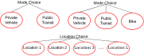
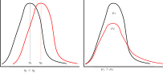
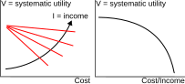
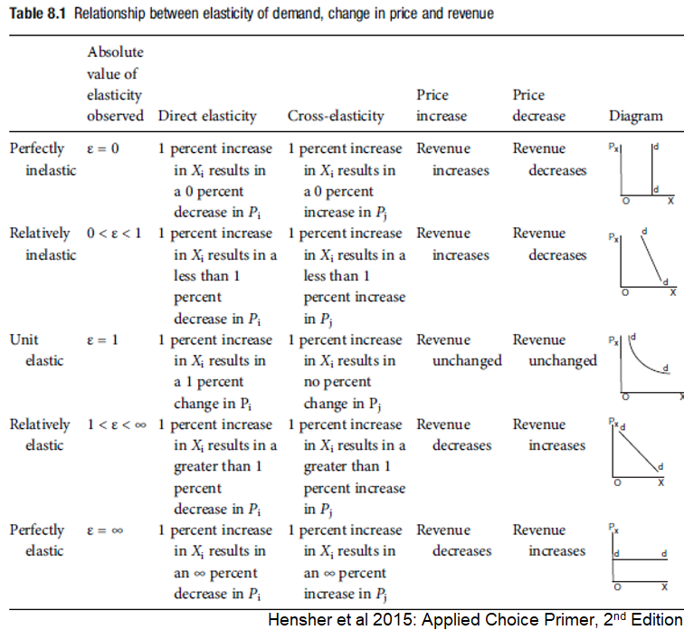

## Outline {.smaller}

::: incremental
- Discrete multinomial choice - Type I EV Distribution
- Multinomial Logit (MNL) - Scale and Systematic Utility Function
- MNL Estimation & Specification
- Elasticity, Marginal Effect, & Substitution
- IIA & IIA violation tests
:::

# Discrete Choice Multinomial Choice - Type I Extreme Value Distribution

## Binary versus Multinomial Choice
{fig-align="center"}

## Binary versus Multinomial Choice
{fig-align="center"}

## Discrete Multinomial Choice {.smaller}
A multinomial choice reduced into an equivalent binary choice problem:

{.absolute top="150" left="0"}

$$𝑈_𝑗 \ge \max_{j,j' \in C_i, j \neq j'} U_{j'}$$
$$𝑈_𝑗 \ge 𝑈_𝑘 \text{; } k \neq j \text{ & } j,k \in C_i$$

- where $C_i$ is the **choice set** of decision maker $i$, $j$ is the **best alternative**, and $k$ is the **second best** alternative

- Probability of choosing alternative j:

$$Pr⁡(𝑗) = Pr⁡((𝑉_𝑗+\epsilon_𝑗) \ge (𝑉_𝑘+\epsilon_𝑘 ))$$
$$Pr⁡( 𝑗)=Pr⁡(\epsilon_𝑘 \leq (𝑉_𝑗−𝑉_𝑘+\epsilon_𝑗 )) \text{ (a CDF function)}$$

## Discrete Multinomial Choice {.smaller}
A multinomial choice reduced into an equivalen
Choice probability in a multinomial choice context:
$$Pr⁡(𝑗)=Pr⁡(\epsilon_𝑘 \leq (𝑉_𝑗−𝑉_𝑘+\epsilon_𝑗 ))$$

Probability distribution of random utility ($\epsilon$) needs to be fully specified to get the unconditional probability:
$$Pr⁡(𝑗)=\int_{\epsilon_𝑗=−\infty}^{+\infty}\int_{\epsilon_𝑘=−\infty}^{𝑉_𝑗−𝑉_𝑘+\epsilon_𝑗} 𝑓(\epsilon_𝑗,\epsilon_𝑘)𝑑 \epsilon_𝑗 𝑑 \epsilon_𝑘$$

  - Specification of univariate distribution, $f(\epsilon_k)$ , and the joint distribution, $f(\epsilon_j,\epsilon_k)$, are necessary
- Possible distributions: 
  - Multivariate normal distribution
  - Type I Extreme Value distribution

## Type I Extreme Value Distribution {.smaller}
- Type I (**Gumbel**) distribution is the most convenient distribution to derive a closed form choice model
  - If \epsilon is Type I Extreme Value (Gumbel) distributed:
$$𝑓(\epsilon)=\mu 𝑒^{−\mu(\epsilon−\eta)} 𝑒^{−𝑒^{−\mu(\epsilon−\eta)}}$$
$$F = e^{-e^{-\mu(\epsilon-\eta)}} \text{; } \mu > 0$$

- $\eta$ is a **location parameter** and $\mu$ is a **positive scale parameter**
- Location parameter is **mode** of distribution
- Scale parameter defines the **dispersion** of the PDF shape

## Type I Extreme Value Distribution
{fig-align="center"}

## Basic Properties of Gumbel distribution {.smaller}
1. The **mode** of the distribution is $\eta$ (the location of peak of the PDF on x axis from zero).
2. The **mean** is ($\eta+\gamma/\mu$), where $\gamma$ = Euler’s constant=0.577.
3. The **variance** is $\pi^2/6\mu^2$.
4. If $\epsilon$ is Gumbel distributed with ($\eta, \mu$), and if $\alpha$ is any positive scalar constant, then ($\alpha \epsilon + V$) is also Gumbel distributed with parameters ($\alpha \eta +V$) and $\mu/\alpha$.
5. If $\epsilon_1$ and $\epsilon_2$ are independent Gumbel variables, then ($\epsilon_1-\epsilon_2$) is **logistically distributed**.
6. If $\epsilon_1$ and \epsilon2 are **Identical and Independent Gumbel variables** with parameters ($\eta_1,\mu$) and ($\eta_2,\mu$) respectively then $\max(\epsilon_1,\epsilon_2)$ is also Gumbel distributed with parameters:      
$$\left(\frac{1}{\mu} \ln⁡(𝑒^{\mu\eta_1}+𝑒^{\mu\eta_2 } ),\mu \right)$$

## Basic Properties of Gumbel distribution {.smaller}
7. If $( \epsilon_1,\epsilon_2,\epsilon_3,\dots ,\epsilon_n )$ are $n$ independent Gumbel distributed variables with parameters ($\eta_1,\mu), (\eta_2,\mu),\dots (\eta_n,\mu)$ respectively then $\max(\epsilon_1,\epsilon_2,\epsilon_3,\dots,\epsilon_n)$ is also Gumbel distributed with parameters (mean, scale): 
$$\left(\frac{1}{\mu} \ln⁡\sum_{𝑗=1}^𝑛 𝑒^{\mu \eta_𝑗}, \mu \right)$$

**Notes:**

- **Homoskedasticity:** Independent Gumbel distributed variables have a common scale parameter, $\mu$. 
- Property 5 is used to derive binomial logit model probability equation.
- Property 7 can be used to derived closed form equation for multinomial logit (MNL) Model.

# Multinomial Logit Model - Scale & Systematic Utility Functions

## Multinomial Logit Model (MNL) {.smaller}
- In case of a multinomial choice situation: Assume random utility ($\epsilon$) is Gumbel distributed with $\eta = 0$ location parameter and a common scale, $\mu$.
- Assume that the utility of the second-best alternative is $U^*$, which is the **maximum of all other alternatives except alternative $j$**, the best one. 
$$𝑈^∗=\max_{k \neq j \text{ & } 𝑗,𝑘 \in 𝐶_𝑖} (𝑉_𝑘+\epsilon_𝑘 )$$
- According to Property 7, $U^*$ is also Gumbel distributed with parameters (mean, scale)

$$ \left( \frac{1}{\mu} \ln \sum_{k \neq j \text{ & } 𝑗,𝑘 \in 𝐶_𝑖} e^{\mu V_k}, \mu \right)$$

## Multinomial Logit Model (MNL) {.smaller}
We can write that the second-best alternative is
$$U^∗= V^∗+\epsilon^∗ \text{, } V^* = \frac{1}{\mu} \ln \sum_{k \neq j \text{ & } 𝑗,𝑘 \in 𝐶_𝑖} e^{\mu V_k}$$		     		
Now for the probability of choosing alternative $j$ (equivalent binary logit form)
$$Pr⁡(𝑗)=Pr⁡\left((𝑉_𝑗+\epsilon_𝑗) \ge \max_{k \neq j \text{ & } 𝑗,𝑘 \in 𝐶_𝑖} (V_k + \epsilon_k)\right)$$
$$Pr⁡(𝑗)=Pr\left((𝑉_𝑗+\epsilon_𝑗) \ge (𝑉^∗+\epsilon^∗)\right)$$
$$Pr⁡(𝑗)=Pr⁡\left((𝑉^∗+\epsilon^∗)−(𝑉_𝑗+\epsilon_𝑗) \leq 0\right)=Pr\left((\epsilon^∗−\epsilon_𝑗) \leq(𝑉_𝑗−𝑉^∗)\right)$$

## Multinomial Logit Model (MNL) {.smaller}
- According to Property 5, this function is logistically distributed. So

$$Pr⁡( 𝑗)=\frac{1}{1+𝑒^{\mu(𝑉^∗−𝑉_𝑗)}} = \frac{e^{\mu V_j}}{e^{\mu V_j}+𝑒^{\mu(𝑉^∗−𝑉_𝑗)}}$$
$$Pr⁡( 𝑗)=\frac{e^{\mu V_j}}{e^{\mu V_j}+e^{\ln \sum_{k \neq j \text{ & } 𝑗,𝑘 \in 𝐶_𝑖} e^{\mu V_k}}}= \frac{e^{\mu V_j}}{e^{\mu V_j}+\sum_{k \neq j \text{ & } 𝑗,𝑘 \in 𝐶_𝑖} e^{\mu V_k}}$$
$$Pr⁡(𝑗)=\frac{e^{\mu V_j}}{\sum_{𝑘 \in 𝐶_𝑖} e^{\mu V_k}}$$

- This is well-known Multinomial Logit Model (MNL) - or softmax function in ML!

## Scale of the MNL Model {.smaller}
- Scale ($\mu$) is inversely related to the variance of random error term
- Variance is $\pi^2/6\mu^2$ for a IID Type I EV error
- As $\mu -> \infty$, Variance $-> 0$
  - All information are captured by the deterministic component ($V$
  - Choice becomes deterministic (the alternative with maximum V is chosen)
- As $\mu -> 0$, Variance $-> \infty$ & $\exp(\mu V) = 1$ 
  - Alternatives are **equally likely**
  - Choice model does not provide any information
- Constant scale, $\mu$, is **not identified** in an MNL using only one dataset
- Separate scale needs to be specified when fusing multiple datasets

## Systematic Utility Function {.smaller}
Systematic utility function: Linear-in-parameter function
$$𝑉_1=\beta_1+\beta_𝑡 𝑥_{1𝑡}+\beta_{1𝑎} 𝑥_𝑎+\beta_𝑏 𝑥_{1𝑏}^2+\beta_{1𝑎𝑐} 𝑥_𝑎^3+\beta_{1𝑎𝑙}  \ln⁡(𝑥_𝑎)+\dots$$
$$𝑉_2=\beta_2+\beta_𝑡 𝑥_{2𝑡}+\beta_{2𝑎} 𝑥_𝑎+\beta_𝑏 𝑥_{2𝑏}^2+\beta_{2𝑎𝑐} 𝑥_𝑎^3+\beta_{2𝑎𝑙} + \ln⁡(x_a)+\dots$$
$$\vdots$$
$$𝑉_J=\beta_J+\beta_𝑡 𝑥_{Jt}+\beta_{J𝑎} 𝑥_𝑎+\beta_𝑏 𝑥_{J𝑏}^2+\beta_{J𝑎𝑐} 𝑥_𝑎^3+\beta_{J𝑎𝑙} + \ln⁡(x_a)+\dots$$

- Alternative Specific Constant - (J-1) are identified
- Permits **non-linear transformed** variables
- Can be **generic** if vary across alternatives
- Must be **alternative-specific** if constant across alternatives (only J-1 are identified)

## Systematic Utility Function {.smaller}
- Systematic utility function: Linear-in-parameter function
$$𝑉_𝑗=\beta_𝑗+\beta_𝑡 𝑥_{𝑗𝑡}+\beta_𝑘 𝑥_{𝑗𝑘}+\dots \text{ (individual variable space)}$$
$$𝑉_𝑗=\beta_𝑗+(\beta_𝑡/\beta_𝑘)𝑥_{𝑗𝑡}+𝑥_{𝑗𝑘}+\dots
\text{ (variable ratio space)}$$
$$
𝑉_𝑗=\beta_𝑗+(\beta_𝑡/\beta_𝑐)𝑥_{𝑗−𝑡𝑖𝑚𝑒}+(\beta_𝑟/\beta_𝑐)𝑥_{𝑗−𝑟𝑒𝑙𝑖𝑎𝑏𝑖𝑙𝑖𝑡𝑦}+𝑥_{𝑗−𝐶𝑜𝑠𝑡}+\dots
$$
$$𝑉_𝑗=\beta_𝑗^{'}+\underset{\begin{array}{c} \text{(Willingness-to-pay} \\ \text{for time savings)} \end{array}}{\beta_{𝑡𝑐}}  𝑥_{𝑗−𝑡𝑖𝑚𝑒}+\underset{\begin{array}{c} \text{(Willingness-to-pay} \\ \text{for improved reliability)} \end{array}}{\beta_{𝑟𝑐}}  𝑥_{𝑗−𝑟𝑒𝑙𝑖𝑎𝑏𝑖𝑙𝑖𝑡𝑦}+𝑥_{𝑗−𝐶𝑜𝑠𝑡}+\dots
$$

# MNL Estimation & MNL Specification

## Estimation of MNL {.smaller}
- Maximum likelihood estimation:
$$\text{Likelihood function: } 𝐿_𝑖=\prod_{𝑗=1}^𝐽 (Pr⁡( 𝑗))^{𝑦_𝑖}
$$
$$\text{Log-likelihood function: } LL_𝑖=\sum_{𝑗 \in C_i} y_j \ln(Pr⁡( 𝑗))
$$
$$\text{Sample log-likelihood function: } LL=\sum_{i=1}^N \sum_{𝑗 \in C_i} y_j \ln(Pr⁡( 𝑗))
$$
- Use **gradient search algorithms**
- Analytical gradient and Hessian functions provide **faster** estimation than numerical gradient and Hessian functions

## Goodness-of-Fit {.smaller}
Model goodness-of-fit is measured by $\rho^2$ value

{.absolute top="150" left="0"}
     
- $k$ = difference in total number of parameters between two models
$$\rho_0^2 = \frac{LL(\beta) - LL(0)}{LL(*) - LL(0)} = 1 - \frac{LL(\beta)}{LL(0)} \text{; } adj-\rho_0^2 = 1 - \frac{LL(\beta) - k}{LL(0)}$$

$$\rho_C^2 = \frac{LL(\beta) - LL(C)}{LL(*) - LL(C)} = 1 - \frac{LL(\beta)}{LL(C)} \text{; } adj-\rho_C^2 = 1 - \frac{LL(\beta) - k}{LL(C)}$$

- Adjusted $\rho^2$ value 0.3 to 0.5 is considered reasonable (*but depends on model*)
- **Alternative:** Comparing predicted vs. observed shares

## Goodness-of-Fit {.smaller}
- Comparing predicted versus observed share of alternatives:
  - Use **holdout sample** (20%-30% sample unused for estimation):
    - Problematic for small sample size
    - Holding out may distort market sample share of the alternatives and thereby the alternative specific constants
  - Use bootstrap:
    - Generate large number of samples bootstrapped from the same sample
    - Compare under/over predictions

## Validation by Bootstrapping

{fig-align="center"}

## Validation by Bootstrapping {.smaller}
Validation by 1000 Bootstrap Sample Simulation

|           Mode         |     Sample   Share (%)    |     Mean   Prediction Error (%)    |     Max   Over-Prediction (%)    |     Max   Under-Prediction (%)    |
|:----------------------:|:-------------------------:|:----------------------------------:|:--------------------------------:|:---------------------------------:|
|     Car   Driver       |             26            |                0.033               |                3.26              |                -2.78              |
|     Car   Passenger    |              1            |                0.015               |                0.91              |                -0.71              |
|     Transit            |             59            |                -0.026              |                4.05              |                -3.36              |
|     Bicycle            |              4            |                0.001               |                2.35              |                -1.72              |
|     Walk               |             11            |                -0.022              |                2.25              |                -2.43              |

## Specification Tests
- Expected signs of the coefficients
- Expected substitution patterns - e.g., value of time savings, etc.
- Likelihood ratio test ($\times$-2 by Wilks Theorem):$-2[LL(\beta)-LL(\beta^{'})]$ is $\chi^2$ distributed with $k$ (= number of restricted parameters = the difference between number of parameters of two models) degrees of freedom
- Goodness-of-Fit measures: Rho-square, AIC, BIC

## Specification of Logit Model {.smaller}
- Logit model works fine if there is no significant random variation of effects of any systematic variables:
  - **Unobserved (random) effects** of any variable (varying across the alternatives and/or observations) violates the identical error term distribution assumption!
- Example:
  - Effects of driving cost is influenced by income only: systematic effect and logit model will work fine with **cost normalized by income**
  - Effects of driving cost influenced by income and some unobserved factor: the logit model will be **mis-specified**

## Specification of Logit Model
- Logit model works fine if choice alternatives are perfectly IIA (independent of irrelevant alternatives): proportional substitution exists
  - **Imperfect competition** or **correlated variations** among subsets of alternatives cause the violation of identical error term distribution assumption!
- Example:
  - People who prefer private car, will prefer taxi **more** than they prefer transit - logit model that considers all alternative modes are IIA will be **mis-specified**

## Collinearity of Independent Variables {.smaller}
- If some variables in the model are **collinear** then  the corresponding parameters can change arbitrarily
  - Unstable parameter estimation
  - Hessian matrix may not be definite
- It is possible to have correlated variables in the discrete choice model unless they are **highly collinear**
  - For high collinearity, a **small change** in model or data causes drastic changes in parameter estimates
- Example: $V=\beta_t(Time)+ \beta_c(Cost)$, if $Cost= \beta_b+ \beta_d(Time)$, then $V= (\beta_t + \beta_t\beta_d)Time+ \beta_c \beta_b$ 
  - **Identification issue**
- **Solution:** Create **composite variable** using the correlated variables (e.g., cost/time)

## Income/Budget Effects {.smaller}
{fig-align="center"}

- Testing income effects:
  - Use $Cost$ and $Cost^2$ as separate variables 
  - If $Cost^2$ has a statistically significant and reasonable parameter value, income effects need to be addressed
- Addressing income effects:
  - Income normalization as ($Cost/Income$) or ($Income-Cost$)
  - Classifying population into different income categories and develop separate models for each
  - Interact income category with other variables

## Aggregation/Market Segmentation
{fig-align="center"}

## Aggregation/Market Segmentation
{fig-align="center"}

- Here 60% of vehicle owners are higher income people
  - 60% of low-income vehicle owners are in white-collar group
- So, we should be careful in categorization at the stage of parameter estimation

## Aggregation/Market Segmentation
- **Multicollinearity** & **correlation** among independent (explanatory) variables may affect model predictions
- Appropriate **clustering method** can be used to derive finite and exhaustive sets of market segments to develop separate models
- Separate model for each market segment can sometimes help **capture heterogeneity** in complicated markets

## Aside: Correlation, Collinearity, & Multicollinearity
- **Correlation:** when an **independent variable** exhibits a strong **linear** relationship with the **dependent variable**
- **Collinearity:** when two (or more) **independent variables** exhibit a strong **linear** relationship - may exist between multiple variables
- **Multicollinearity:** Specific case of collinearity between **more than two variables**
- Collinearity can occur **without linear relationship** between any two variables

# Elasticity, Marginal Effect, & Substitution in MNL

## Marginal Effect/Elasticity:  Attributes of Alternatives {.smaller}
- **Disaggregate Direct elasticity/marginal effect:** with respect to an attribute of the **same alternative**
$$\text{Direct ME} =\frac{\partial Pr⁡(𝑗)}{\partial 𝑥_j}=Pr⁡(𝑗)(1−Pr⁡( 𝑗)) \beta_{𝑥_𝑗}$$
$$\text{Direct E}=  \frac{\partial Pr⁡(𝑗)}{\partial 𝑥_j}\frac{x_j}{Pr(j)}=x_j(1−Pr⁡( 𝑗)) \beta_{𝑥_𝑗}$$

## Marginal Effect/Elasticity:  Attributes of Alternatives {.smaller}
- **Disaggregate Cross elasticity/marginal effect:** with respect to an attribute of **different alternative**
$$\text{Cross ME} =\frac{\partial Pr⁡(𝑗)}{\partial 𝑥_k}=Pr⁡(𝑗)Pr⁡(k) \beta_{𝑥_k}$$
$$\text{Cross E}=  \frac{\partial Pr⁡(𝑗)}{\partial 𝑥_k}\frac{x_k}{Pr(j)}=-x_kPr⁡(k) \beta_{𝑥_k}$$

- Cross elasticity is the same for all other alternative than alternative $k$
- This is **proportional substitution**: an improvement in one alternative, draws proportionately from all other alternatives!

## Fact to check: Attributes of Alternatives {.smaller}
- Summation of all probabilities of a choice model = 1
  - Summation of changes in probabilities (of all alternatives) with respect to a variable (derivative)  = 0
$$\sum_j \frac{\partial Pr(j)}{\partial x_{jp}}=\frac{\partial Pr(j)}{\partial x_{jp}} + \sum_{k \neq j} \frac{\partial Pr(k)}{\partial x_{jp}} \text{; (Considering generic coefficients)}$$
$$\sum_j \frac{\partial Pr(j)}{\partial x_{jp}}=\beta_p Pr(j) (1-Pr(j)) - \beta_p Pr(j)\sum_{k \neq j}Pr(k)$$
$$\sum_j \frac{\partial Pr(j)}{\partial x_{jp}}=\beta_p Pr(j) (1-Pr(j)) - \beta_p Pr(j) (1-Pr(j)) = 0$$

- This is true for **any discrete choice model** and can be used to verify accuracy of elasticity calculation

## Aggregating Elasticity: Attributes of Alternatives {style="font-size: 0.65em;"}
- Disaggregate discrete choice model gives disaggregate values of elasticity for each data point in the sample
- Approaches to meaningfully aggregate:
  - Naïve approach: Consider sample average values of explanatory variables (x) to calculate sample average elasticity
  - Estimate elasticity for each sample respondent and draw distribution of elasticity values
  - Probability weighted sample enumeration (PWSE):

::::: columns
::: {.column width="50%"}
$$𝐸_{𝑥_𝑘}^𝑗=\sum_{i=1}^n \frac{Pr_i(j)}{\sum_{i=1}^n Pr_i(j)}E_{x_k}^{Pr_i(j)}$$
:::
::: {.column width="50%"}
- $i$ is the individual in the sample of size n
- $j$ is the specific alternative
- $x$ is the variable of elasticity
- $j=k$ indicates direct elasticity
- $j \neq k$ indicates cross-elasticity
:::
:::::
- Same approach is application for marginal effect and for  any choice model

## 
{fig-align="center"}

## Marginal/Elasticity: Attributes of Choice Maker/Choice Context {style="font-size: 0.65em;"}
- Such attributes have **alternative-specific coefficients**: For example, consider income of choice maker
$$\frac{\partial Pr(j)}{\partial Inc_{ij}} = (1-Pr(j))Pr(j)\beta_{inc,ij} \text{; }j,k\in C_i$$
$$\frac{\partial Pr(j)}{\partial Inc_{ik}} = Pr(j)Pr(k)\beta_{inc,ik}$$
- Corresponding sum of all alternatives, $j \neq k$
$$\sum_{j \neq k} \frac{\partial Pr(j)}{\partial Inc_{ik}} = -Pr(j) \sum_{k \neq j} Pr(k) \beta_{inc,ik}$$
- Rate of change of $Pr(j)$ with respect to income of individual, i:
$$\frac{\partial Pr(j)}{\partial Inc_i} = \underset{\text{Direct Elasticity}}{\frac{\partial Pr(j)}{\partial Inc_{ij}}} + \underset{\text{Cross Elasticity}}{\sum_{j \neq k}\frac{\partial Pr(j)}{\partial Inc_{ij}}}$$

## Marginal/Elasticity: Attributes of Choice Maker/Choice Context {.smaller}
- Rate of change of $Pr(j)$ with respect to income:
$$\frac{\partial Pr(j)}{\partial Inc_i} = \frac{\partial Pr(j)}{\partial Inc_{ij}} + \sum_{k \neq j} \frac{\partial Pr(j)}{\partial Inc_{ik}} = (1-Pr(j))Pr(j)\beta_{inc,ij}-Pr(j)\sum_{k \neq j} Pr(k) \beta_{inc,ik}$$
$$\frac{\partial Pr(j)}{\partial Inc_i} = Pr(j)\beta_{inc,ij}-Pr(j)Pr(j)\beta_{inc,ij}-Pr(j)\sum_{k \neq j}Pr(k)\beta_{inc,ik}$$
$$\frac{\partial Pr(j)}{\partial Inc_i} = Pr(j)\left( \beta_{inc,ij} - \overline{\beta_{inc}} \right)$$
$$\overline{\beta_{inc,i}} = \sum_{k \in C_i} Pr(k)\beta_{inc,k} \begin{array}{c}\text{; probability weighted average of}\\ \text{alt specific income parameters}\end{array}$$

## Marginal/Elasticity: Attributes of Choice Maker/Choice Context {.smaller}
- Elasticity $Pr(j)$ with respect to income:
$$\frac{\partial Pr(j)}{\partial Inc}\frac{Inc}{Pr(j)} = Inc(\beta_{inc,j} - \overline{\beta_{inc}})$$
$$\overline{\beta_{inc}} = \sum_{k \in C_i} Pr(k)\beta_{inc,k}$$
- Elastictiy $Pr(j)$ with respect to age:
$$\frac{\partial Pr(j)}{\partial Age}\frac{Age}{Pr(j)} = Age(\beta_{age,j} - \overline{\beta_{age}})$$
$$\overline{\beta_{age}} = \sum_{k \in C_i} Pr(k)\beta_{age,k}$$

## Aggregating Elasticity: Attributes of Choice Maker/Choice Context
- Use similar approach of aggregating market share from disaggregate choice model predictions (discussed in detail later):
  1. Microsimulation
  2. Sample enumeration
  3. Classification with naïve aggregation
  4. Naïve aggregation
- Same approach is application for marginal effect and for  any choice model

## Marginal/Elasticity of Categorical Variables {.smaller}
- Choice elasticity with respect to a categorical variable is **tricky**
  - “1% change in choice probability with respect to 1% change in a categorical variable" - e.g., presence/absence of parking spot at destination has little meaning!
- **Arc-elasticity** is the best way: Express the change in choice probability for the presence/absence of the categorical variable - i.e., *ceteris paribus*
$$E_{x_i}^{ji} = \frac{Pr(j)_{x_i=1} - Pr(j)_{x_i=0}}{(x_i=1) - (x_i=0)}\frac{((x_i=1)+(x_i=0))/2}{((Pr(j)_{x_i=1})+(Pr(j)_{x_i=0}))/2}$$
$$E_{x_i}^{ji} = \frac{Pr(j)_{x_i=1} - Pr(j)_{x_i=0}}{Pr(j)_{x_i=1}+Pr(j)_{x_i=0}}$$
- Arc-elasticity can also be used for continuous variables

## Proportional Substitution {.smaller}
- **Proportional substitution:** an improvement in one alternative, draws proportionately from all other alternatives!

{fig-align="center"}

## IIA: Independent and Irrelevant Alternatives {.smaller}
$$\frac{Pr(j)}{Pr(k)} = \frac{\exp(V_j)}{\exp(V)k)} = \exp(V_j - V_k)$$

- This property is derived from assumption: the random utilities,$\epsilon$ are **independent and identical in distribution**
- Random error are identically distributed, having **same scale or variance**
\begin{equation}
\begin{bmatrix} \epsilon_1 \\
\epsilon_2 \\
\epsilon_3 \end{bmatrix} = 
\begin{bmatrix} \sigma^2 & 0 & 0 \\
0 & \sigma^2 & 0 \\
0 & 0 & \sigma^2 \end{bmatrix} = 
\frac{\pi^2}{6 \mu^2} \begin{bmatrix} 1 & 0 & 0 \\
0 & 1 & 0 \\
0 & 0 & 1 \end{bmatrix}
\end{equation}

## IIA: Independent and Irrelevant Alternatives {.smaller}
- **Example of blue bus/red bus:** If real alternatives are not following IIA, then MNL would induce serious error
  - **Previous:** P(car)=1/2 and P(blue bus)=1/2
  - Now a new red bus is introduced and under the IIA assumption that the ratio of choice probabilities between car and blue bus must be constant, so P(car)=1/3, P(blue bus)=1/3 and P(red bus)=1/3, which is unrealistic
Actual will be P(car)=1/2, P(blue bus)=1/4 and P(red bus)=1/4; but now the ratio of car and blue bus is not the same as was before introducing red bus

## IIA: Independent and Irrelevant Alternatives {style="font-size: 0.65em;"}
- Three alternatives with same utilities 1: car, 2: blue bus and 3: red bus and (V1=V2=V3=V) 
  - Now probability of choosing 1: car would be compared against the second highest attractive alternative ($U^*$)
$$𝑈^∗=\max⁡( 𝑈_2,𝑈_3)=𝑉^∗+\epsilon^∗
$$
- As per Gumbel distribution with 0 mean and unit scale
$$𝑉^∗=\ln⁡( 𝑒^{𝑉_2}+𝑒^{𝑉_3})=\ln⁡( 2𝑒^𝑉)=\ln⁡(2)+𝑉
$$
- This step assumed that the random errors of alternative 2(blue bus) and 3(red bus) are independent and in such case, probability of choosing car:
$$𝑃(𝑐𝑎𝑟)=\frac{1}{1+𝑒^{𝑉^∗−𝑉_1}} = \frac{1}{1+𝑒^{𝑉+\ln⁡2−𝑉}} = \frac{1}{1+2}=1/3
$$

## IIA: Independent and Irrelevant Alternatives {.smaller}
- Actually, 2(blue bus) and 3(red bus) are **perfectly correlated** and in that case the maximum utility of 2 and 3 are simply $(V+\epsilon)$ that means $V^*=V$
$$𝑃(𝑐𝑎𝑟) = \frac{1}{1+𝑒^{𝑉^∗−𝑉_1}} = \frac{1}{1+𝑒^{𝑉−𝑉}} = \frac{1}{1+1}=1/2
$$
- That means IID assumption makes $V^*$ **too high** by an amount of $\ln2$ 
- IIA is **attributed to disaggregate/individual choice situations, not the overall market share**

## IIA Violation Test {.smaller}
- We can always test IIA by developing alternative nested logit models.
- It is also possible to test statistically whether IIA is violated or not without developing nested logit models.

**Steps for testing IIA:**

1. Estimate the base MNL  model for the **full set of alternatives** and refer to its parameters as $\beta_C$    
2. **Remove** one or more alternatives with suspected IIA violation problem to make the constrained choice set $C^{'}$
3. This will reduce the number of parameters in the new model and its parameter set is then $\beta_C^{'}$ 

- In each case, in addition to estimating the parameter sets we also produce **variance covariance matrices**, $\Sigma$, (Inverse of Hessian Matrix) of the estimated parameters sets

## IIA Violation Test {.smaller}
4. Let us refer to the corresponding matrices as $\Sigma_{\beta_C}$ and $\Sigma_{\beta_C^{'}}$ of the full model and the restricted model, respectively
5. If the alternatives in the choice set **satisfy IIA** then the two variance-covariance matrices will have the **same values for corresponding cells**: $\Sigma_{\beta_C} = \Sigma_{\beta_C^{'}}$    
6. Let us consider the Null Hypothesis, $H_0: \beta_C = \beta_C^{''}$   
7. Conduct tests:
  - Hausman and McFadden Test
  - Small and Haiso Test

## IIA Violation Test {.smaller}
**Hausman and McFadden Test** (Econometrica, 1984):
$$(\hat{\beta}_{C^{'}}−\hat{\beta}_C)^𝑇(\Sigma_{\hat{\beta_C^{'}}}−\Sigma_{\hat{\beta}_C})^{−1}(\hat{\beta}_{C^{'}}-\hat{\beta_C})$$
- This is $\chi^2$ distributed with **degrees of freedom equal to the number of alternatives removed in the restricted model**

**Small and Haiso Test** (International Economic Review, 1985):

- Conduct likelihood ratio test between base model and the restricted model
$$−2(𝐿𝐿_{\hat{\beta}_𝐶^{'}}−𝐿𝐿_{\hat{\beta}_𝐶})$$
- This likelihood ratio is $\chi^2$ distributed with **degrees of freedom equal to the number of alternatives removed in the restricted model**