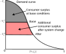
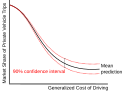

## Outline {.smaller}

::: incremental
- Policy Evaluation
- Forecasting & Prediction
- Confidence Intervals on Predictions
- Model transferability & Parameter Updating
:::

# Policy Evaluation Using MNL

## Policy Evaluations {.smaller}
- Elasticity:
  - Direct elasticity
  - Cross elasticity
- Consumer surplus & social welfare analysis
- Marginal rate of substitution between two variables (ratio of corresponding parameters) in the choice model:
  - Value of Travel Time Savings (**VOTTS**) in mode choice
  - Willingness to pay for improved transit reliability in transit choice
  - Willingness to pay for transit accessibility in home location choice

## Willingness-to-pay Analysis {style="font-size: 0.65em;"}
- Systematic utility function needs to have cost as a variable $p$ along with another variable of interest $x$.
$$V_j = V_j(p_j,x_j, \dots) -> p\text{ is a continuous variable & } V_j \text{ is differentiable in x and p}$$
- **Assumption:** Any changes in $x$ is balanced by changes in $p$ to maintain same level of utility: total utility does not change
$$V_j = V_j(p_j,x_j, \dots) = V_j((p_j+\delta p_j),(x_j + \delta x_j), \dots)$$
- Using first-order Taylor series expansion
$$V_j(p_j,x_j, \dots) = V_j(p_j,x_j, \dots) + \delta p_j \frac{\partial V_j(p_j,x_j, \dots)}{\partial p_j} + \delta x_j \frac{\partial V_j(p_j,x_j, \dots)}{\partial x_j}$$
- After transposing (assuming overall utility change is zero)
$$\frac{\delta p_j}{\delta x_j} = - \frac{V_j(p_j, x_j, \dots)/\partial x_j}{V_j(p_j, x_j, \dots)/\partial p_j} \text{; additional price to compensate additional x}$$

## Willingness-to-pay Analysis {.smaller}
- For linear-in-parameter utility function $V_j = \beta_j + \beta_p p_j + \beta_x x_j + \dots$
- Willing-to-pay for any continuous variable change $\frac{\partial p_j}{\partial x_j} = - \frac{\beta_x}{\beta_p}$
- Value of Travel Time Savings (**VOTTS**): additional amount of money to **reduce** 1 unit of time
$$VOTTS = \frac{\partial p_j}{- \partial t_j} = \frac{\beta_t}{\beta_p}$$
- Value of Reliability (**VOR**) or Safety (**VOS**) : additional amount of money to **increase** 1 level of reliability (r), safety (s)
$$VOR = \frac{\partial p_j}{+ \partial r_j} = - \frac{\beta_r}{\beta_p}\text{; } VOS = - \frac{\partial p_j}{+ \partial s_j} = \frac{\beta_s}{\beta_p}$$

## Consumer Surplus {.smaller}
{fig-align="center"}

$$\Delta CS = \int_{V_j^1}^{V_j^2} Pr_i(j|V_j, V_{k \in C_i, k \neq j}) d V_j = \int_{V_j^1}^{V_j^2} \frac{\exp(\mu V_j)}{\sum_{k \in C_i} \exp(\mu V_k)}d V_j$$

## Consumer Surplus {.smaller}
For Changes in only one (independent) alternative ($j$):
$$\Delta CS = \frac{1}{\mu}\ln\left(\exp(\mu V_j^2) + \sum_{k \in C_i} \exp(\mu V_k)\right) - \frac{1}{\mu}\ln\left(\exp(\mu V_j^1) + \sum_{k \in C_i} \exp(\mu V_k)\right)$$
- For changes in **multiple alternatives** (existence of equal or unequal cross-elasticity, e.g., nested logit, GEV, mixed logit) the integral is **path dependent** since it becomes conditional upon an income effect
- For logit model
$$\Delta CS = \frac{1}{\mu}\ln\left(\sum_{j \in C_i} \exp(\mu V_j^2)\right) - \frac{1}{\mu}\ln\left(\sum_{j \in C_i} \exp(\mu V_j^1)\right)$$

## Welfare Analysis {.smaller}
- **Compensating variation analysis:** normalized changes in expected maximum utility of a particular choice before/after any changes (policy/infrastructure):
$$U_j = \beta_I(I-p_j) + \sum \beta x + \epsilon_j$$ 
- where $I$ = income, $p_j$ = price/cost, $\beta_I$ = marginal utility of income = coefficient of income normalized cost
- Consumer surplus (**CS**):
$$CS = \frac{1}{\mu}\left(\ln \sum_j \exp \left(\mu (\beta_I(I-p_j) + \sum \beta x)\right) \right)$$
- Compensting variation (**CV**) in monetary value:
$$CV = \frac{1}{|\beta_I|}\left( CS_{after-change} - CS_{before-change} \right)$$

# Forecasting & Prediction Using Disaggregate Choice Models

## Applying Disaggregate Model for Forecasting {.smaller}
- Aggregate forecasting
$$\sum_{individuals} \text{Individual Behaviour} = \text{Aggregate(collective) Outcome}$$
- Can synthesize people with attributes  from census data - i.e., 100% microsimulation with **synthetic population**

{fig-align="center"}

## Applying Disaggregate Choice Model for Forecasting {.smaller}
- We do aggregate forecasts, so why do we need disaggregate models?
  - **Aggregation suppresses information** -> misleading information after data aggregation (i.e., Simpson’s Paradox & Ecological Fallacy)
  - Statistical inefficiency of aggregate approach
  - Although we aggregate the forecast, we can explicitly capture information at individual level
  - We can track many **sensitive policy issues**
  - Aggregation of forecast is possible at any level we want, as the model is disaggregate
  - Sometimes modelling at disaggregate level makes the model independent of artificial zonal structures and the model may be transferrable

## Aggregation Methods for Forecasting
- Microsimulation
- Sample enumeration
- Na&iuml;ve aggregation
- Classification with na&iuml;ve aggregation

## Microsimulation {.smaller}
<table>
  <tr>
    <th>Synthetic Population</th>
    <th colspan="5" style="text-align:center;">Choice Alternatives</th>
  </tr>
  <tr>
    <td></td>
    <td>1</td>
    <td>2</td>
    <td>...</td>
    <td>J</td>
    <td>Sum</td>
  </tr>
  <tr>
    <td>1</td>
    <td>$Pr(1|x_1,\beta)$</td>
    <td>$Pr(2|x_1,\beta)$</td>
    <td>.</td>
    <td>$Pr(J|x_1,\beta)$</td>
    <td>1</td>
  </tr>
  <tr>
    <td>2</td>
    <td>$Pr(1|x_2,\beta)$</td>
    <td>$Pr(2|x_2,\beta)$</td>
    <td>.</td>
    <td>$Pr(J|x_2,\beta)$</td>
    <td>1</td>
  </tr>
  <tr>
    <td>...</td>
    <td>.</td>
    <td>.</td>
    <td>.</td>
    <td>.</td>
    <td>.</td>
  </tr>
  <tr>
    <td>N</td>
    <td>$Pr(1|x_N,\beta)$</td>
    <td>$Pr(2|x_N,\beta)$</td>
    <td>.</td>
    <td>$Pr(J|x_N,\beta)$</td>
    <td>1</td>
  </tr>
  <tr>
    <td>Sum</td>
    <td>N(1)</td>
    <td>N(2)</td>
    <td></td>
    <td>N(J)</td>
    <td>N</td>
  </tr>
  <tr>
    <td>Market share</td>
    <td>N(1)/N</td>
    <td>N(2)/N</td>
    <td></td>
    <td>N(J)/N</td>
    <td>1</td>
  </tr>
</table>

## Sample Enumeration {style="font-size: 0.65em;"}
- Rather than 100% population, use a representative sample
  - If we have a representative sample, $N_S$, of the target population $N_T$ then:
  $$\overset{\sim}{W_i} = \text{Predicted sample share of j} = \frac{1}{N_S}\sum_{s=1}^{N_S} Pr(j|X_S,\beta)$$

<table>
  <tr>
    <th>Representative Sample</th>
    <th colspan="5" style="text-align:center;">Choice Alternatives</th>
  </tr>
  <tr>
    <td></td>
    <td>1</td>
    <td>2</td>
    <td>...</td>
    <td>J</td>
    <td>Sum</td>
  </tr>
  <tr>
    <td>1</td>
    <td>$Pr(1|x_1,\beta)$</td>
    <td>$Pr(2|x_1,\beta)$</td>
    <td>.</td>
    <td>$Pr(J|x_1,\beta)$</td>
    <td>1</td>
  </tr>
  <tr>
    <td>2</td>
    <td>$Pr(1|x_2,\beta)$</td>
    <td>$Pr(2|x_2,\beta)$</td>
    <td>.</td>
    <td>$Pr(J|x_2,\beta)$</td>
    <td>1</td>
  </tr>
  <tr>
    <td>...</td>
    <td>.</td>
    <td>.</td>
    <td>.</td>
    <td>.</td>
    <td>.</td>
  </tr>
  <tr>
    <td>N</td>
    <td>$Pr(1|x_S,\beta)$</td>
    <td>$Pr(2|x_S,\beta)$</td>
    <td>.</td>
    <td>$Pr(J|x_S,\beta)$</td>
    <td>1</td>
  </tr>
  <tr>
    <td>Sum</td>
    <td>n(1)</td>
    <td>n(2)</td>
    <td></td>
    <td>n(J)</td>
    <td>$N_S$</td>
  </tr>
  <tr>
    <td>Market share</td>
    <td>n(1)/$N_S$</td>
    <td>n(2)/$N_S$</td>
    <td></td>
    <td>n(J)/$N_S$</td>
    <td>1</td>
  </tr>
</table>

## Sample Enumeration {.smaller}
- Although there may be sampling error, the expected value should match the population average
- For a ‘G’ stratified sample:
$$\overset{\sim}{W_i} = \sum_{g=1}^G \left(\frac{N_g}{N_T}\right) \frac{1}{N_{sg}}\sum_{t=1}^{N_{sg}} Pr(j|X_t,\beta)$$

- Here, $N_g$ is the population in segment $g$, $N_{sg}$ is the sample population in segment $g$, and $N_T$ is the target population
- Sample for estimation should be representative
- Sample enumeration can generally be used to test policies in the short-run during which the base population sample can be assumed to remain representative

## Naïve Aggregation {.smaller}
- Considering mean value of $X_t$ as the unique value for whole population gives crude estimate
<table>
  <tr>
    <th>Population Strata</th>
    <th colspan="5" style="text-align:center;">Choice Alternatives</th>
  </tr>
  <tr>
    <td></td>
    <td>1</td>
    <td>2</td>
    <td>...</td>
    <td>J</td>
    <td>Sum</td>
  </tr>
  <tr>
    <td>Market share</td>
    <td>$Pr(1|x_1,\beta)$</td>
    <td>$Pr(2|x_1,\beta)$</td>
    <td>.</td>
    <td>$Pr(J|x_1,\beta)$</td>
    <td>1</td>
  </tr>
</table>

## Classification with Naïve Aggregation {.smaller}
- Classify population into a  number of strata and consider population within a particular segment as **homogenous** (having same attributes)
- When sample enumeration infeasible, can use classification with naïve aggregation
- Categorization is based on attributes / market segmentation

<table>
  <tr>
    <th>Population Strata</th>
    <th colspan="5" style="text-align:center;">Choice Alternatives</th>
  </tr>
  <tr>
    <td></td>
    <td>1</td>
    <td>2</td>
    <td>...</td>
    <td>J</td>
    <td>Sum</td>
  </tr>
  <tr>
    <td>1</td>
    <td>$Pr(1|x_1,\beta)$</td>
    <td>$Pr(2|x_1,\beta)$</td>
    <td>.</td>
    <td>$Pr(J|x_1,\beta)$</td>
    <td>1</td>
  </tr>
  <tr>
    <td>2</td>
    <td>$Pr(1|x_2,\beta)$</td>
    <td>$Pr(2|x_2,\beta)$</td>
    <td>.</td>
    <td>$Pr(J|x_2,\beta)$</td>
    <td>1</td>
  </tr>
  <tr>
    <td>...</td>
    <td>.</td>
    <td>.</td>
    <td>.</td>
    <td>.</td>
    <td>.</td>
  </tr>
  <tr>
    <td>n</td>
    <td>$Pr(1|x_S,\beta)$</td>
    <td>$Pr(2|x_S,\beta)$</td>
    <td>.</td>
    <td>$Pr(J|x_S,\beta)$</td>
    <td>1</td>
  </tr>
  <tr>
    <td>Sum</td>
    <td>n(1)</td>
    <td>n(2)</td>
    <td></td>
    <td>n(J)</td>
    <td>n</td>
  </tr>
  <tr>
    <td>Market share</td>
    <td>n(1)/n</td>
    <td>n(2)/n</td>
    <td></td>
    <td>n(J)/n</td>
    <td>1</td>
  </tr>
</table>

# Confidence Interval on Predictions 

## Confidence Interval on Predictions {.smaller}
- Estimated parameters are MVN distributed by central limit theorem
- Same approach is applicable for any choice model
{fig-align="center"}

## Confidence Interval of Predictions: Elasticity, Market Share, & Revenue
{fig-align="center"}

## Confidence Interval of Predictions: Elasticity, Market Share, Revenue
{fig-align="center"}

## Confidence Interval of Predictions: Elasticity, Market Share, & Revenue
{fig-align="center"}

# Sampling & Discrete Choice Models

## Sampling {.smaller}
- Sampling of choice makers from population using RP or SP survey:
  - **Exogenous Sample:** Sample share of alternatives are: 
    - Identical to those of population shares if representative
    - Not-identical if not representative
  - **Endogenous/Choice-based Sample:** Respondents are sampled based on observed choices
    - Sample share of alternatives are different from those of population shares
- **Sampling of choice alternatives:** irrespective of sampling of respondents:
  - Choice alternatives are collectively exhaustive
  - When choice alternative space is large, then sample alternatives

## Sampling of Choice Makers {.smaller}
$$\text{Choice Model: }Pr(j|x,\beta)$$

- Exogenous sampling of choice makers (Stratified Random Sampling) 
  - Population size, $N$
  - Stratification of population into total $G$ groups
  - Share (%) individual in a particular group, g in population, $W_g$
  - Sample size, $n$
  - Share (%) individual in the particular group, $g$ in sample, $w_g$
  - Probability of an individual being selected in the sample, $q_g = \frac{w_g n}{W_g N}$
  - Sampling probability is not a function of parameter, $\beta$

## Sampling of Choice Makers {.smaller}
$$\text{Choice Model: }Pr(j|x,\beta)$$

- Exogenous sampling of choice makers (Simple Random Sampling)
- Probability of an individual being selected in the sample, $q_g = \frac{n}{N}$
- Sampling probability is not a function of parameter, $\beta$
- For representative exogenous sample (stratified/simple random sampling) no correction to choice model estimates is needed
  - For non-representative sample, parameters except the Alternative Specific Constants (ASC) do not require correction
  - ASC needs to corrected/updated to match actual **market share**

## Sampling of Choice Makers {.smaller}
$$\text{Choice Model: }Pr(j|x(j),\beta)$$

- Endogenous/Choice-based sampling of choice makers (randomly select choice makers of specific choices)
  - Selection of respondent of specific choice maker group (e.g. transit users, driver, bicyclists) still should be random in some way
  - Choice model with choice-based sample produces **unbiased estimates** of all parameters except the Alternative Specific Constants (ASC)
  - ASCs need to corrected/updated to match actual **market share**

## Sampling of alternatives: Large Choice Set {.smaller}
- Large number of alternatives (e.g., destination location choice model), a random sample of alternatives can be used to estimate the model - where $C = \text{full choice set}$ and $G = \text{subset of alternatives drawn from C}$
- Conditional probability of selecting a subset of alternatives
$$q(G|j) > 0 \text{; if G includes the chosen alt. j}$$
$$q(G|j) = 0 \text{; if G excludes the chosen alt. j}$$
- Joint probability that $J$ is drawn with non-zero probability and $j$ is chosen by an individual $i$
$$Pr(G,j) = q(G|j)Pr(G) = Pr(j|G)Q(G) \text{; (Bayes Theorem)}$$
$$\text{Marginal probability: } Q(G) = \sum_{k \in C} Pr(k)q(G|k) \text{; (Sum over all possible subsets of j')}$$

## Sampling of alternatives: Large Choice Set {.smaller}
- Choice probability of alternative $j$ from subset:
$$Pr(j|G)Q(G) = q(G|j)Pr(j)$$
$$Pr(j|G)Q(G) = \frac{Pr(j)q(G|j)}{Q(G)} = \frac{Pr(j)q(G|j)}{\sum_{k \in C} Pr(k)q(G|k)} = \frac{\exp(V_j)q(G|j)}{\sum_{k \in C} \exp(V_k)q(G|k)}$$
- For any subset, $q$, that does not include $k$, $q(G|k)=0$, so:
$$Pr(j|G) = \frac{\exp(V_j)q(G|j)}{\sum_{k \in G} \exp(V_k)q(G|k)} \text{; within C, any G without k drops out}$$
$$Pr(j|G) = \frac{\exp(V_j)\exp(\ln(q(G|j)))}{\sum_{k \in G} \exp(V_k)\exp(\ln(q(G|j)))} = \frac{\exp(V_j + \ln(q(G|j)))}{\sum_{k \in G} \exp(V_k + \ln(q(G|j)))}$$

## Sampling of alternatives: Large Choice Set {.smaller}
- Choice model with sampling from the alternatives:
$$Pr(j|G) = \frac{\exp(V_j + ln(q(G|j)))}{\sum_{k \in G} \exp(V_k + ln(q(G|k)))} \text{; } q(G|j) = \prod_{l=1}^{G-1}Pr(l)$$
- where $Pr(l)$ is the binary probability of drawing a choice
- Under simple random sampling, samples are drawn **uniformly with equal probability**
- This makes the additional $ln(q(G|j))$ redundant (same for all alternative and so drops out: uniform conditional property) - MNL result becomes standard form
- **Not true for other models** such as nested logit, GEV, or mixed logit

## Managing Large Choice Sets
- Reducing alternatives:
  - Use various feasibility constraints to reduce number of alternatives
  - Random sampling from large choice set
  - Wrong choice set may generate **distorted predictions**

# Transferability and Updating Model Parameters: MNL

## Model Transferability {.smaller}
- Transferability issues:
  - Systematic bias.
  - Local conditions.
- Model Updating Issues:
  - Systematic bias of the model is captured by model constants. - Alternative Specific Constants (ASC) are **error basket** - At a minimum level, the constant terms change from place-to-place
  - **Scale parameter** of random error term changes from place-to-place
  - **Model specification** changes from place-to-place

## Updating MNL Model Parameters {.smaller}
- MNL predictions matches the **market shares of sample data used to estimate the model parameter**
- Updating ASC of MNL for matching population shares if those are different (if the sample is not representative or model is transferred to a different spatial/temporal context) in sample share:
- **Iterative ASC adjustment** for the utility functions of the choice alternatives (including the based alternative for which the ASC is estimated to be 0)
$$𝐴𝑆𝐶_{𝑢𝑝𝑑𝑎𝑡𝑒𝑑, j} = 𝐴𝑆𝐶_{𝑡𝑜−𝑏𝑒−𝑎𝑑𝑗𝑢𝑠𝑡𝑒𝑑, j} + \ln\left(\frac{\text{actual market share, j}}{\text{predicted market share, j}} \right)
$$

## Updating MNL Model Parameters {.smaller}
- Population market share of $𝑗= 𝐻_𝑗$
- Sample share of $j = h_j$
- Adjustment proprtion of $j = s_j - \frac{H_j}{h_j}$
- Adjusted choice probability $Pr(j) = \frac{s_j \exp(\beta_{0,j}+\sum \beta x)}{\sum_k s_k \exp(\beta_{0,k}+\sum \beta x)}$
$$Pr(j) = \frac{\exp(\beta_{0,j}+\sum \beta x + \ln(s_j))}{\sum_k \exp(\beta_{0,k}+\sum \beta x + \ln(s_k))} = \frac{\exp(\beta_{0,j}+\sum \beta x + \ln(H_j/h_j))}{\sum_k \exp(\beta_{0,k}+\sum \beta x + \ln(H_k/h_k))}$$
$$\text{Updated } \beta_{0,j} = (\beta_{0,j})_{estimated} + ln(H_j/h_j)$$

## Further topics (among many others)
- Logit model with **probabilistic choice set formation**
- Logit model with **multiple overlapping choice sets**
- Logit model with **myopic preferences regarding specific alternatives**
