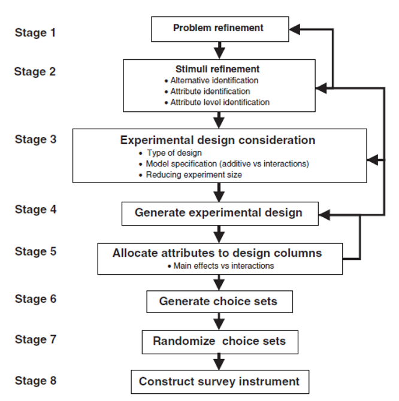
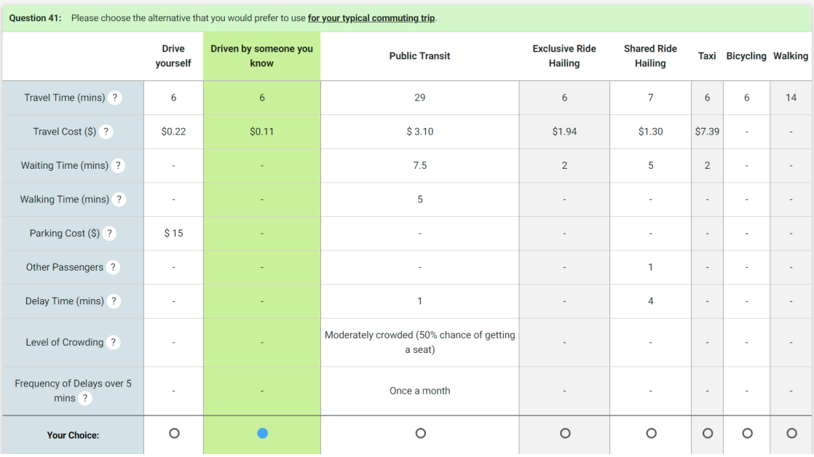
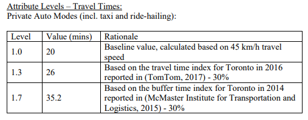
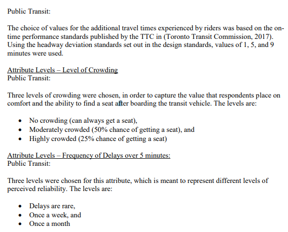

## Outline

::: incremental
3. Stated choice experiments
:::

# Stated Preference Experiments

## Need for Stated Preference Data {.smaller}
- It is rare to **observe** the decision-making process
- What if we want to know demand for a good or service that **does not exist yet** (at least not locally)?
  - **Example**: Would you use a vertical takeoff and landing (VTOL) vehicle?

{fig-align="center" width="50%"}

## Comparison of Revealed Preference (RP) & Stated Preference (SP) Observations
::: {style="font-size: 0.35em;"}

| Factor                                        | Revealed Preference                                                                                                                                                 | Stated Preference                                                                                                                                         | Comment                                |
|-----------------------------------------------|---------------------------------------------------------------------------------------------------------------------------------------------------------------------|-----------------------------------------------------------------------------------------------------------------------------------------------------------|----------------------------------------|
| Form of observed choice behaviour             | Actual 'compromise' choice with real-world constraints                                                                                                              | Potentially concerns 'preferences' rather than 'compromise' choice as hypothetical context can be used to remove real-world constraints                   | Relates to purpose of survey           |
| Establishing values for explantory variables  | Engineering values expensive to establish; stated values inexpensive but potentially distorted by faulty perceptions and ex-post justification                      | Presented vlaues inexpensive and unambiguous                                                                                                              | Advantage with SP                      |
| Correlation structure in estimation data      | Correlation structure uncontrolled; analyst must accept potentially high correlations among explanatory variables & deal with impacts on correlations in estimation | Correlation structure controllable; analyst can dictate correlations among explanatory variables & avoid high correlations in estimation                  | Why SP used                            |
| Explanation of causal-behavoural connections | Indirect reliance on correlations between observed behaviour & engineering values                                                                                   | Direct in that respondents are asked to react to indicated attribute values                                                                               | Not an issue in SP with careful design |
| Flexibility                                   | Limited to real-world contexts                                                                                                                                      | Not limited to real-world contexts but validity increasingly questionable as context becomes less familiar; ability to consider non-existing alternatives | Why SP used                            |
| Transferability                               | More limited as real-world conditions & context are tightly woven into observed behaviour                                                                           | Less limited as hypothetical context can be specified to be identical across implementations                                                              | Advantage with SP                      |
| Speed of implementation                       | Can be slow depending on availability of engineering values for explanatory variables                                                                               | Relatively fast; opportunity to collect multiple responses from same respondent                                                                           | Advantage with SP                      |
| Validity                                      | Near certain                                                                                                                                                        | Can be questionable; experimental design is key                                                                                                           | Why RP used                            |
| Certainty about respondent comprehension      | Certain to extent that respondent made actual choice in real-world situation                                                                                        | Uncertain to extent that respondent does not understand process but can be validated with supplemental questions                                          | Not often an issue                     |
:::

## Stated Preference Methods {.smaller}
- **Contingent Valuation** - CV
  - Explicit stated willingness-to-pay (WTP) information for policy or product
  - Cannot be used to disentangle WTP for individual attributes
- **Conjoint Analysis**
  - Ranking/rating of alternatives
  - Can assign WTP to individual attributes
  - Ranking as dependent variable questionable because not interval scaled
  - Do respondents rank/rate alternatives in real-world?
- **Stated choice (or preference)** - SP
  - Based on random utility theory
  - Our preferred approach in this class

## Stated Preference (SP) Experiment Components
- **Alternatives**: person making choice between alternatives
- **Attributes**: alternatives are defined by their attributes
- **Attribute levels**: attributes are described by their levels

## SP Experimental Design Process
{fig-align="center" width="50%"}

## Example - Mode Choice in Toronto (Experiment)
{fig-align="center" width="50%"}

## Example - Mode Choice in Toronto (Attributes)
::::: columns
::: {.column width="50%"}
{fig-align="center"}
:::
::: {.column width="50%"}
{fig-align="center"}
:::
:::::

## SP Considerations 1
- Will the experiment be **labelled** (i.e., alternative names have meaning beyond their ordering) or **unlabelled**?
- Will a **non-purchase or status quo** alternative be presented?
- Will the outputs be used as inputs to another model – e.g., a network model does not allow for a comfort attribute so may not want to include it in experiment

## SP Considerations 2
- Should not omit realistic alternatives a respondent might consider in practice – e.g., driver response to a new road pricing initiative
  - May consider alternative modes, but more likely you will change departure time or destination choice to avoid more expensive road tolls on that day
- Do not want to place respondent in an unnecessarily unrealistic scenario
- Always do internal and external pilots!

## SP Experimental Design 1 {.smaller}
- **Attribute level balance**: Each attribute level appears an equal number of times over design
- Desirable property although it may impact on **statistical efficiency**

**Example:**
Consider a design with four attributes, where two have two levels, one has three levels and the last has four levels. In the classical jargon in this field we would refer to this as a 22 31 41 factorial design; note that the product of levels to the power of attributes (48 in this case) represents the total number of choice tasks needed to recover all effects (i.e. main or linear effects and all interactions), i.e. a full factorial design (more about this below).Assuming each attribute will produce a unique parameter estimate (i.e. main effects only), the smallest design would require just four choice tasks based on the number of parameters criterion; however, to maintain attribute level balance, the smallest possible design would require 12 choice tasks (12 being divisible without remainder by 2, 3, and 4).

## SP Experimental Design 2 {.smaller}
- **Number of attribute levels**: More levels requires more choice tasks due to additional parameters
- **Varying range**: Use a wide range (e.g., $0-$30) is statistically preferable over a narrow range (e.g., $0-$10) because theoretically leads to smaller standard errors
- Wide range may also be problematic though due to **dominated alternatives**
- Narrow range may result in alternatives for which respondents cannot distinguish differences

## SP Experimental Design 3
- Which option would you pick?

|      Attribute     |      Bus    |     Car    |
|:------------------:|:-----------:|:----------:|
|     Travel time    |      11     |      10    |
|     Travel cost    |     2.75    |      3     |

- Why would someone pick bus in this case?

|      Attribute     |      Bus    |     Car    |
|:------------------:|:-----------:|:----------:|
|     Travel time    |      31     |      10    |
|     Travel cost    |     2.75    |      3     |

## SP Experimental Design 4
- **Recommendation**: Use the worst case utility specification to design the experiment
- Can always estimate simpler models but choosing a design with too few choice tasks may preclude estimating valid model specifications at a later state

## Experiment Design Processes 1
- **Full factorial (FF) design**: consider all possible attribute combinations
- **Fractional factorial design**: 
  - Randomly select from (FF) design
  - **Orthogonal design**: zero correlation between attributes (great for linear models)
- **Efficient design**: Reduce parameter variance and covariance (D-efficient)

## Experiment Design Processes 2 {.smaller}
- Two competing schools of thought on how to define the covariance matrix ($S^2$ calculated as negative inverse of **Fisher information/Hessian matrix**)
  - **Null hypothesis school**: Zero-valued parameter priors. Assumes designs are orthogonal within alternatives and maximize differences in attribute levels between alternatives
    - Can only be developed assuming a multinomial logit (MNL) model
  - **Non-null hypothesis school**: Non-zero-valued parameter priors
- **Bayesian (B)-efficient design**:
  - Allow for a range of parameter priors (e.g., $\theta~N(-0.8,2)$)
  - Not limited to orthogonal coding
  - Directly related to expected outcome of modeling process
  - Can assume any model structure, not just MNL

## Experiment Design Processes 3
- **D-efficient** named for use of scaled (by 1/K to account for number of parameters) matrix determinant
- **S-efficient** named for use of sample size provide theoretically minimum sample size to obtain asymptotically significant parameter estimates

## Experiment Design Processes 4 {.smaller}
- **Fisher information matrix** for N respondents given by $\mathbf{𝑰}_𝑁(\theta)$
$$\mathbf{𝑰}_𝑁 (\theta)=N\mathbf{𝑰}_1 (\theta)$$
Then 
$$\mathbf{𝑺}_𝑁^2=(\mathbf{𝑰}_𝑛 (𝜃))^{−1}=1/𝑁 \mathbf{𝑺}_1^2$$
And
$$𝑠𝑒_𝑁 (\theta)=\frac{𝑠𝑒_1 (\theta)}{\sqrt{N}}$$
- Standard errors exhibit diminishing marginal returns for increasing sample size

## Design Blocking {.smaller}
- Often the number of choice tasks generated by a design is too large for a single respondent to handle
- **Blocking** is a method to group choice tasks
  - Uses modular algebra to decide one effect that will be confounded
  - For orthogonal designs, need to define an additional blocking column to allocate subsets of generated tasks to respondents
  - Use of orthogonal design avoids one respondent seeing only high price alternatives and another only low price alternatives

## Non-Purchase Option (NPO) {.smaller}
- Not commonly applied in transportation literature
- Risk with exclusion is that respondent will be forced to pick a **non-preferred option**
- Olsen and Swait (1998) find
  - If NPO is not present, attribute weights will differ from those observed when NPO is offered in design
  - If NPO is included in design, analyst should be able to identify more non-linear preference structures
  - Models based on data with no NPO may show low predictive capacity for choice situations including an NPO, whereas those with an NPO will show good predictive capacity in any situation

## Challenge of Interattribute Correlation {.smaller}
- Despite the use of the word **correlation**, not a statistical concept
- Refers to **cognitive perception** that respondents associated to attributes we include in experiments
- **Price** & **quality** often associated with each other by respondents
- How will a person respond to a high price and low quality alternative?
  - Respondent may stop taking survey experiment seriously, biasing the results

## SP-Pivoted-Off-RP {.smaller}
- One method for overcoming unrealistic choice experiments
- Ask the respondent a series of RP questions, then base (**pivot**) the SP experiment off their response
- **Example**: What are your home and work locations?
  - Use **Google Directions API** to obtain typical driving, transit, cycling, and walking times for the given OD pair
  - Specify SP travel times that are within ±15% of the Google values by mode
  - Similarly, calculate travel costs based on supplemental per mile values

## Other Design Recommendations 1 {.smaller}
- Focus on specific rather than general behaviour - e.g., respondents should be asked how they would respond to an alternative on a given occasion, rather than in general
- Use realistic choice context - e.g., recent personal experience of (pivot design) 
  - Retaining the constraints on choice required to make the context realistic - e.g., ‘if today you would prefer to use the car to visit your dentist in the evening directly from work, then retain this restriction in your choices’
- Use existing (perceived) levels of attributes so that the options are built around existing experience

## Other Design Recommendations 2 {.smaller}
- Keep choice experiments simple - we respond to very complex choices in practice but do so over a long period of time
- Allow respondents to opt for response outside set of experimental alternatives - e.g., in mode choice exercise, if all options become too unattractive respondent may decide to change destination, time of travel, or not to travel at all
- Allow ‘will do something else’ alternative - could be programmed to branch to another exercise exploring precisely these other options
- Make sure alternatives are clearly and unambiguously defined (difficult when dealing with qualitative attributes like security or comfort)
  - E.g., do not express alternatives as ‘poor’ or ‘improved’, which are vague and prone to different interpretations by respondents - what measures or facilities, etc.).