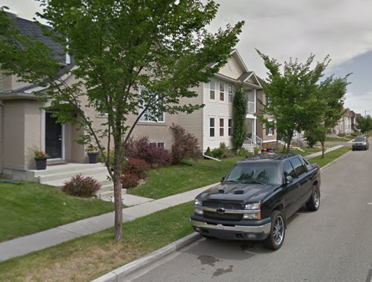
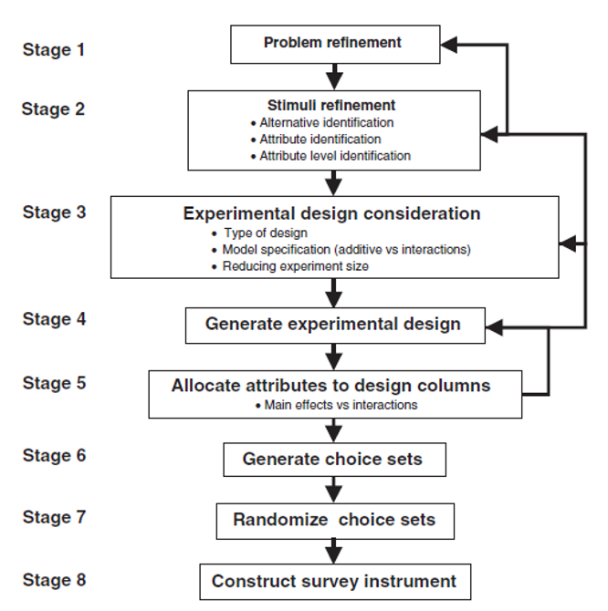
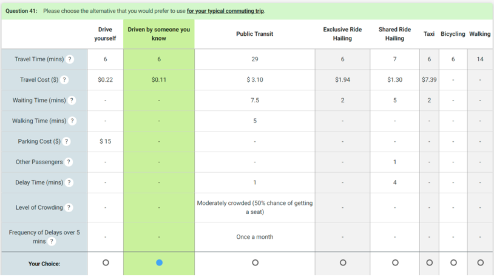
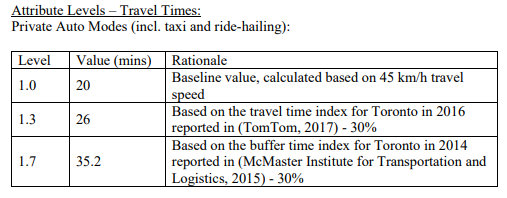
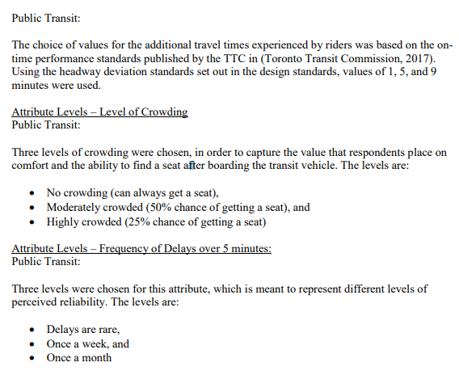
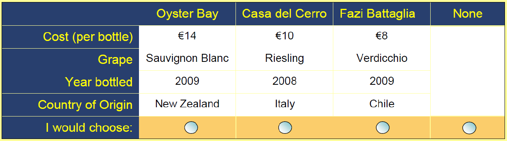
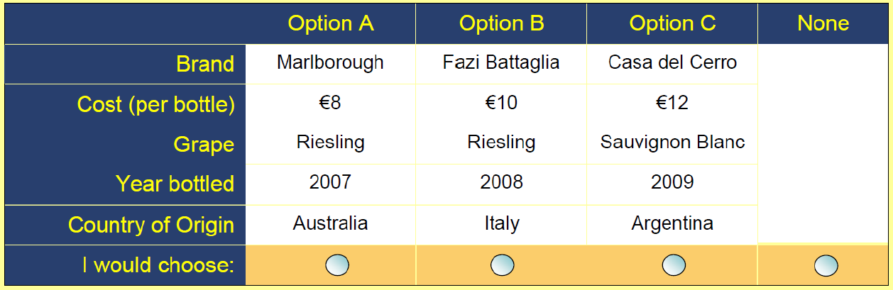
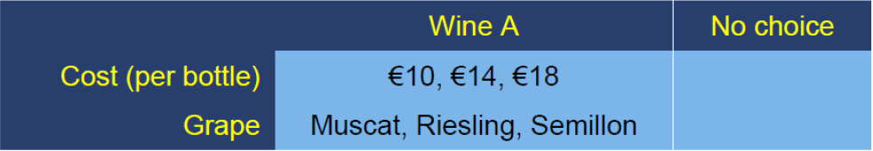

## Outline

::: incremental
1. Motivation for SP
2. Main Characteristics of DCE
3. Experimental Design
:::

# Motivation for Stated Preference (SP) Data

## Need for Stated Preference Data {.smaller}
- It is rare to **observe** the decision-making process
- What if we want to know demand for a good or service that **does not exist yet** (at least not locally)?
  - **Example**: Would you use a vertical takeoff and landing (VTOL) vehicle?

{fig-align="center" width="50%"}

## Need for Stated Preference Data {.smaller}

:::: {.columns}

::: {.column width="50%"}
{width="80%"}
{width="80%"}
:::

::: {.column width="50%"}
{width="80%"}
{width="80%"}
:::

::::

## Comparison of Revealed Preference (RP) & Stated Preference (SP) Observations
::: {style="font-size: 0.35em;"}

| Factor                                        | Revealed Preference                                                                                                                                                 | Stated Preference                                                                                                                                         | Comment                                |
|-----------------------------------------------|---------------------------------------------------------------------------------------------------------------------------------------------------------------------|-----------------------------------------------------------------------------------------------------------------------------------------------------------|----------------------------------------|
| Form of observed choice behaviour             | Actual 'compromise' choice with real-world constraints                                                                                                              | Potentially concerns 'preferences' rather than 'compromise' choice as hypothetical context can be used to remove real-world constraints                   | Relates to purpose of survey           |
| Establishing values for explantory variables  | Engineering values expensive to establish; stated values inexpensive but potentially distorted by faulty perceptions and ex-post justification                      | Presented vlaues inexpensive and unambiguous                                                                                                              | Advantage with SP                      |
| Correlation structure in estimation data      | Correlation structure uncontrolled; analyst must accept potentially high correlations among explanatory variables & deal with impacts on correlations in estimation | Correlation structure controllable; analyst can dictate correlations among explanatory variables & avoid high correlations in estimation                  | Why SP used                            |
| Explanation of causal-behavoural connections | Indirect reliance on correlations between observed behaviour & engineering values                                                                                   | Direct in that respondents are asked to react to indicated attribute values                                                                               | Not an issue in SP with careful design |
| Flexibility                                   | Limited to real-world contexts                                                                                                                                      | Not limited to real-world contexts but validity increasingly questionable as context becomes less familiar; ability to consider non-existing alternatives | Why SP used                            |
| Transferability                               | More limited as real-world conditions & context are tightly woven into observed behaviour                                                                           | Less limited as hypothetical context can be specified to be identical across implementations                                                              | Advantage with SP                      |
| Speed of implementation                       | Can be slow depending on availability of engineering values for explanatory variables                                                                               | Relatively fast; opportunity to collect multiple responses from same respondent                                                                           | Advantage with SP                      |
| Validity                                      | Near certain                                                                                                                                                        | Can be questionable; experimental design is key                                                                                                           | Why RP used                            |
| Certainty about respondent comprehension      | Certain to extent that respondent made actual choice in real-world situation                                                                                        | Uncertain to extent that respondent does not understand process but can be validated with supplemental questions                                          | Not often an issue                     |
:::

## Stated Preference Methods {.smaller}
- **Contingent Valuation** - CV
  - Explicit stated willingness-to-pay (WTP) information for policy or product
  - Cannot be used to disentangle WTP for individual attributes
- **Conjoint Analysis**
  - Ranking/rating of alternatives
  - Can assign WTP to individual attributes
  - Ranking as dependent variable questionable because not interval scaled
  - Do respondents rank/rate alternatives in real-world?
- **Stated choice (or preference)** - DCE
  - Based on random utility theory
  - Our preferred approach in this class
  - Also includes best-worst scaling (BWS) and ranking via exploded logit

# Main Characteristics of DCE

## DCE Experiment Components
- **Alternatives**: person making choice between alternatives
- **Attributes**: alternatives are defined by their attributes
- **Attribute levels**: attributes are described by their levels

## DCE Experimental Design Process
{fig-align="center" width="50%"}

## Example - Mode Choice in Toronto (Experiment)
{fig-align="center" width="50%"}

## Example - Mode Choice in Toronto (Attributes)
::::: columns
::: {.column width="50%"}
{fig-align="center"}
:::
::: {.column width="50%"}
{fig-align="center"}
:::
:::::

## Labelled vs. Unlabelled Alternatives {.smaller}
- Will the experiment be **labelled**?
  - Brands, models, alternative names have meaning beyond their ordering
  - Useful when there are many attributes which are always associated with the label
  - Useful if brand matters
{width="100%"}

## Labelled vs. Unlabelled Alternatives {.smaller}
{width="70%"}

## Status Quo Alternative {.smaller}
- Will a **non-purchase or status quo** alternative be presented?
- Can measure 'non-participation' via hurdle functions
- 'Opt-out' or 'status quo' choice can result from choice complexity

## Non-Purchase Option (NPO) {.smaller}
- Not commonly applied in transportation literature
- Risk with exclusion is that respondent will be forced to pick a **non-preferred option**
- Olsen and Swait (1998) find
  - If NPO is not present, attribute weights will differ from those observed when NPO is offered in design
  - If NPO is included in design, analyst should be able to identify more non-linear preference structures
  - Models based on data with no NPO may show low predictive capacity for choice situations including an NPO, whereas those with an NPO will show good predictive capacity in any situation

## Use Case {.smaller}
- Will the outputs be used as inputs to another model?
  - A traffic network model does not allow for a comfort attribute so may not want to include it in experiment
- Will the experiment be used for willingness-to-pay analysis?
  - Need to consider incentive compatibility

## DCE Considerations
- Should not omit realistic alternatives a respondent might consider in practice – e.g., driver response to a new road pricing initiative
  - May consider alternative modes, but more likely you will change departure time or destination choice to avoid more expensive road tolls on that day
- Do not want to place respondent in an unnecessarily unrealistic scenario
- Always do internal and external pilots!

## Incentive Compatibility {.smaller}
- 3 views of the world
  - People try to truthfully reveawl their preferences irrespective of the incentives they face?
  - People tell the truth if there are no consequences associated with their answers?
  - People only try to tell the truth when it is in their economic interest to do so?
- Survey results need to be seen as consequential - how will results be used?

## Gibbard and Satterthwaite theorem {.smaller}
- Gibbard (1973) and Satterthwaite (1975) theorem:
  - About strategic behaviour and insincere choice
  - No mechanism with larger than a binary message space can be incentive compatible without restricting the space of allowable preference functions
  - Not all binary discrete choice questions are incentive compatible - e.g., take-it-or-leave-it offer (vote doesn't influence any other offers that may be made to the agents) or coersive payment mechanism (each agent required to pay independent of their decision)
- Rarely discussed in transportation literature vs. considered vital in environmental economics

## How many alternatives? {.smaller}
- No clear answer
- Incentive compatible = 2
- More alternatives = more information
- Cognitive burden: more alternatives = more error variance
- Relevance sometimes more important than cognitive burden: real life choices are complex & might involve many alternatives!

## Which/how many attributes to include?
- No theory: case study-specific choice
- Complete, relevant, comprehensive
  - Pre-testing
  - Research questions
  - Avoid ambiguity (e.g., comfort)
  - Be aware of perceptual inter-attribute correlations
- Valuation: include at least one monetary attribute
- Too many attributes increases cognitive burden

## Challenge of Inter-attribute Correlation {.smaller}
- Despite the use of the word **correlation**, not a statistical concept
- Refers to **cognitive perception** that respondents associated to attributes we include in experiments
- **Price** & **quality** often associated with each other by respondents
- How will a person respond to a high price and low quality alternative?
  - Respondent may stop taking survey experiment seriously, biasing the results

## What and how many attribute levels to include? {.smaller}
- What is the reasonable range of each attribute?
  - Shown to have an influence upon results through behaviour and statistical impacts
- Wider range = more differences between alternatives
  - Choices easier to make
  - Probabilities closer to deterministic (0/1)
  - If levels too wide, respondents may not take study seriously
- Wide range preferred over narrow range (but keep it realistic)
- Keep levels evenly spaced

## Be Random
- Avoid bias through randomization
- Random order of choice tasks
- Random order of alternatives
- Random order of attributes

# Experimental Design

## Experiment Design Processes
- **Full factorial (FF) design**: consider all possible attribute combinations
- **Fractional factorial design**: 
  - Randomly select from (FF) design
  - **Orthogonal design**: zero correlation between attributes (great for linear models)
- **Efficient design**: Reduce parameter variance and covariance (D-efficient)

## Attribute Level Balance {.smaller}
- Each attribute level appears an equal number of times over design
- Desirable property although it may impact on **statistical efficiency**

**Example:**
Consider a design with four attributes, where two have two levels, one has three levels and the last has four levels. In the classical jargon in this field we would refer to this as a 22 31 41 factorial design; note that the product of levels to the power of attributes (48 in this case) represents the total number of choice tasks needed to recover all effects (i.e. main or linear effects and all interactions), i.e. a full factorial design (more about this below).Assuming each attribute will produce a unique parameter estimate (i.e. main effects only), the smallest design would require just four choice tasks based on the number of parameters criterion; however, to maintain attribute level balance, the smallest possible design would require 12 choice tasks (12 being divisible without remainder by 2, 3, and 4).

## Attribute Level Balance {.smaller}
- Balanced design with each attribute level occuring an equal number of times, independent of the alternative

::: {.columns}

::: {.column width="48%"}
### Option A

| A1 | A2 | A3 |
|---:|---:|---:|
| 10 | 3 | 2 |
| 20 | -5 | 4 |
| 30 | 3 | 6 |
| 30 | -5 | 6 |
| 30 | -5 | 2 |
| 20 | -5 | 6 |
:::

::: {.column width="48%"}
### Option B

| A1 | A2 | A3 |
|---:|---:|---:|
| 10 | 3 | 2 |
| 20 | -5 | 4 |
| 30 | 3 | 4 |
| 10 | 3 | 4 |
| 10 | -5 | 2 |
| 20 | 3 | 6 |
:::

:::

## Attribute Level Balance {.smaller}

- Balanced design with each attribute level occurring an equal number of times across choice sets.

::: {.columns}

::: {.column width="50%"}
### Option A

| A1 | A2 | A3 |
|---:|---:|---:|
| 10 | 3 | 2 |
| 20 | -5 | 4 |
| 30 | 3 | 6 |
| 10 | -5 | 6 |
| 30 | -5 | 2 |
| 20 | 3 | 4 |

::: 
::: {.column width="50%"}
### Option B

| A1 | A2 | A3 |
|---:|---:|---:|
| 10 | 3 | 2 |
| 30 | -5 | 6 |
| 20 | -5 | 4 |
| 20 | 3 | 4 |
| 10 | -5 | 2 |
| 30 | 3 | 6 |
:::

:::

## DCE Experimental Design {.smaller}
- **Number of attribute levels**: More levels requires more choice tasks due to additional parameters
- **Varying range**: Use a wide range (e.g., $0-$30) is statistically preferable over a narrow range (e.g., $0-$10) because theoretically leads to smaller standard errors
- Wide range may also be problematic though due to **dominated alternatives**
- Narrow range may result in alternatives for which respondents cannot distinguish differences

## Full Factorial Design
- Generates all possible choice tasks using all combinations of attribute levels
$$\prod_{A=1}^{\text{No. of A}} \text{No. of levels of A}$$

## Full Factorial Design Example
- How many choice sets does the full factorial design have?

{width="80%"}

::: {.fragment}
Solution: 9
:::

{width="80%"}

::: {.fragment}
Solution: 12
:::

## Full Factorial Design
- Advantages
  - Always orthogonal: mathematical consraint requiring that all attributes are statistically independent of one another (i.e., zero correlation between attributes)
  - Always balanced
  - Allows estimation of all main and interaction effects
- Disadvantages
  - May contain many choice tasks
  - Many of the choice tasks reveal hardly any information

## Design Blocking {.smaller}
- Often the number of choice tasks generated by a design is too large for a single respondent to handle
- **Blocking** is a method to group choice tasks
  - Uses modular algebra to decide one effect that will be confounded
  - For orthogonal designs, need to define an additional blocking column to allocate subsets of generated tasks to respondents
  - Use of orthogonal design avoids one respondent seeing only high price alternatives and another only low price alternatives

## Fractional Design
- Use a subset of choice sets from the full factorial design
- Not all effects can be mesured (e.g., only main effects and a few interaction effects)
- Lower bound on number of choice observations for parameter identification still exists

## Fractional Factorial Orthogonal Designs
- Consider the following example: find an orthogonal fractional factorial main effects only design

::: {.columns}

::: {.column width="50%"}

Model:
$$U_1 = \beta_1 + \beta_2 X_{11} + \beta_3 X_{21} + \beta_4 X_{31} $$
$$U_2 = \beta_5 + \beta_2 X_{12} + \beta_3 X_{22} + \beta_6 X_{32} $$
$$U_3 = \beta_2 X_{13} + \beta_3 X_{23} + \beta_7 X_{33} $$

::: 
::: {.column width="50%"}
Attribute levels:
$$X_{11},X_{12},X_{13} \in {2,4,6}$$
$$X_{21},X_{22},X_{23} \in {1,3,5}$$
$$X_{31},X_{32},X_{33} \in {3,5,7}$$

:::

:::

- The design needs to have enough choice sets to:
  - Satisfy design degrees of freedom
  - Satisfy attribute level balance
  - Satisfy orthogonality

## Fractional Factorial Orthogonal Designs
- The smallest design that is orthogonal in all main effects has 12 choice sets (7 parameters / (3-1) independent comparisons)
  - Not easy to find orthogonal design
  - Out of $\approx 10^51$ possible designs (from $27 \times 26 \times 25$ and $3^3=27$ profiles)...
- Orthogonal fractional factorial design might still be too large for any one respondent to complete all tasks
- Can be hard to find a blocking column

## Problems with Orthogonal Designs
- Design must have no missing data
- Design must have no missing blocks
- Attribute levels must be evenly spaced
- Must use orthogonal coding (-1,0,1) not effects coding (0/1/1)
- Not possible to discard 'silly' choice sets

## Dominated Designs
- Which option would you pick?

|      Attribute     |      Bus    |     Car    |
|:------------------:|:-----------:|:----------:|
|     Travel time    |      11     |      10    |
|     Travel cost    |     2.75    |      3     |

- Why would someone pick bus in this case?

|      Attribute     |      Bus    |     Car    |
|:------------------:|:-----------:|:----------:|
|     Travel time    |      31     |      10    |
|     Travel cost    |     2.75    |      3     |

## DCE Experimental Design
- **Recommendation**: Use the worst case utility specification to design the experiment
- Can always estimate simpler models but choosing a design with too few choice tasks may preclude estimating valid model specifications at a later state

## Does orthogonality matter?
- Parameter estimates reflect preference strength
- Standard errors come from variance-covariance matrix of estimated model
- Orthogonality - correlation structure of the data (design) matrix ($X$)
  - Linear regression - variance-covariance matrix is given by $\frac{\sigma^2}{X'X}$
  - Models for discrete choice - non-linear! ($I(\beta) = \sum_n X_n'W_nX_n}$ where $W_n$ is a weight matrix defined by the model structure)

## Experiment Design Processes {.smaller}
- Two competing schools of thought on how to define the covariance matrix ($S^2$ calculated as negative inverse of **Fisher information/Hessian matrix**)
  - **Null hypothesis school**: Zero-valued parameter priors. Assumes designs are orthogonal within alternatives and maximize differences in attribute levels between alternatives
    - Can only be developed assuming a multinomial logit (MNL) model
  - **Non-null hypothesis school**: Non-zero-valued parameter priors
- **Bayesian (B)-efficient design**:
  - Allow for a range of parameter priors (e.g., $\theta~N(-0.8,2)$)
  - Not limited to orthogonal coding
  - Directly related to expected outcome of modeling process
  - Can assume any model structure, not just MNL

## Efficient Design
- Efficiency of design

```{mermaid}
flowchart LR
A[Experimental Design] --> B[Survey Administration]
B --> C[Choice Data]
C --> D[Parameter Estimation]
 
classDef box fill:#d9d9d9,stroke:#bdbdbd,color:#000;
class A,B,C,D box;
```
- How can we determine the efficiency of a design without conducting a survey?
  - Assume prior parameter estimates (best guess)
  - Approximate the variance-covariance matrix for the parameter estimates

## Efficient Design
- Asymptotic variance-covariance (AVC) matrix - approximation of true VC matrix

$$\mathbf{\Sigma} = \begin{pmatrix} se(\hat{\beta}_1)^2 & \cdots & 0 \\ \vdots & \ddots & \vdots \\ 0 & \cdots & se(\hat{\beta}_K)^2 \end{pmatrix}$$
- "Asymptotic" - assuming very large sample or many repetitions using a small sample

## How to derive AVC matrix?
- Simulate it considering a design and prior parameters
  - For large sample of virtual respondents, compute observed utilities for all alternatives and add random terms, then assume each respondent chooses the alternative with highest utility
- Analytical solution considering $X,\beta$
  - Determine log-likelihood of choice function
  $$L_N(\beta|X,y)=\sum_{n=1}^N\sum_{s=1}^S\sum_{j=1}^J y_{jsn} log(P_{jsn}(X|\beta)$$
  - Determine Fischer information matrix (Hessian of second derivatives of LL
  $$I_N(\beta|X,y)=\frac{\partial^2L_N(\beta|X,y)}{\partial \beta \partial \beta'}$$
  - AVC = negative inverse of Fisher information matrix
  $$\Omega_N(\beta|X,y)=-I_N^{-1}(\beta|X,y)$$

## Forms of Efficient Design
- **D-efficient** named for use of scaled (by 1/K to account for number of parameters) matrix determinant
- **S-efficient** named for use of sample size provide theoretically minimum sample size to obtain asymptotically significant parameter estimates

## Efficient Design {.smaller}
- **Fisher information matrix** for N respondents given by $\mathbf{𝑰}_𝑁(\theta)$
$$\mathbf{𝑰}_𝑁 (\theta)=N\mathbf{𝑰}_1 (\theta)$$
Then 
$$\mathbf{𝑺}_𝑁^2=(\mathbf{𝑰}_𝑛 (𝜃))^{−1}=1/𝑁 \mathbf{𝑺}_1^2$$
And
$$𝑠𝑒_𝑁 (\theta)=\frac{𝑠𝑒_1 (\theta)}{\sqrt{N}}$$
- Standard errors exhibit diminishing marginal returns for increasing sample size

## SP-Pivoted-Off-RP {.smaller}
- One method for overcoming unrealistic choice experiments
- Ask the respondent a series of RP questions, then base (**pivot**) the SP experiment off their response
- **Example**: What are your home and work locations?
  - Use **Google Directions API** to obtain typical driving, transit, cycling, and walking times for the given OD pair
  - Specify SP travel times that are within ±15% of the Google values by mode
  - Similarly, calculate travel costs based on supplemental per mile values

## Other Design Recommendations {.smaller}
- Focus on specific rather than general behaviour - e.g., respondents should be asked how they would respond to an alternative on a given occasion, rather than in general
- Use realistic choice context - e.g., recent personal experience of (pivot design) 
  - Retaining the constraints on choice required to make the context realistic - e.g., ‘if today you would prefer to use the car to visit your dentist in the evening directly from work, then retain this restriction in your choices’
- Use existing (perceived) levels of attributes so that the options are built around existing experience

## Other Design Recommendations {.smaller}
- Keep choice experiments simple - we respond to very complex choices in practice but do so over a long period of time
- Allow respondents to opt for response outside set of experimental alternatives - e.g., in mode choice exercise, if all options become too unattractive respondent may decide to change destination, time of travel, or not to travel at all
- Allow ‘will do something else’ alternative - could be programmed to branch to another exercise exploring precisely these other options
- Make sure alternatives are clearly and unambiguously defined (difficult when dealing with qualitative attributes like security or comfort)
  - E.g., do not express alternatives as ‘poor’ or ‘improved’, which are vague and prone to different interpretations by respondents - what measures or facilities, etc.).