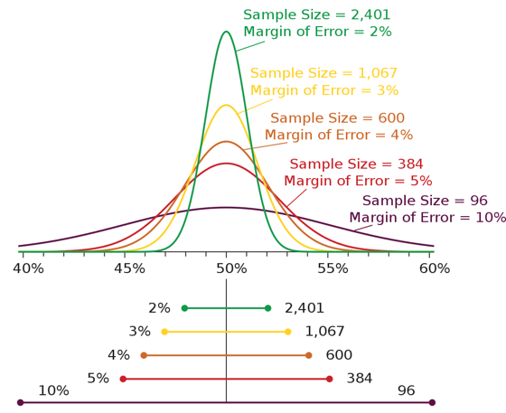
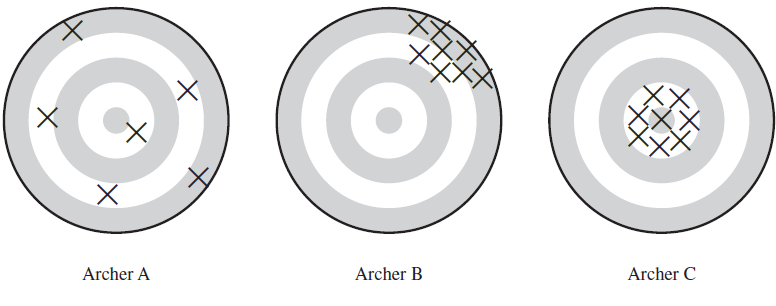
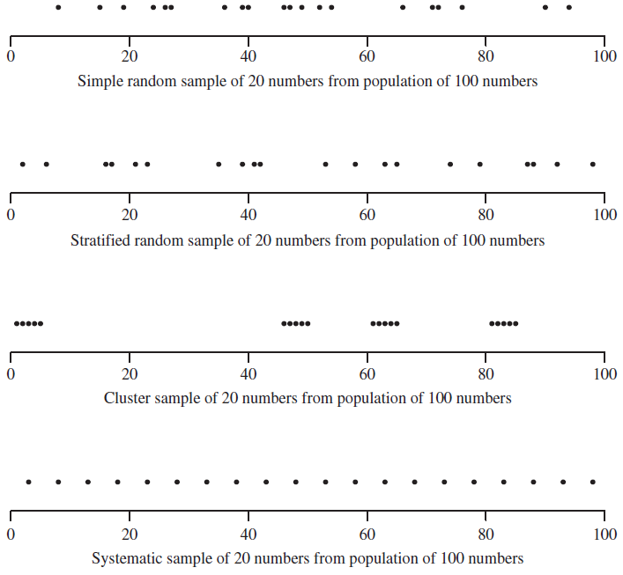

## Outline

::: incremental
1. Survey terms
2. Survey design
:::

# Survey Terms

## Infrastructure Demand & Surveys
- Infrastructure demand is a function of individual decisions
- Analysis requires behavioral data: surveys!​
- As with other forms of engineering analysis, survey experiments require careful design & execution
- A demand analyst must be an expert in both the subject area & knowledgeable about survey methods

## Survey Jargon {.smaller}
- **Observation unit**: basic unit of measurement. In human populations, it is often individuals.​
- **Target population**: The complete set of observations we want to study. E.g., university students, seniors, or adults with a driver’s license.​
- **Sample**: A subset of the population.​
- **Sampled population**: The collection of all possible observation units that might have been chosen in a sample. E.g., Canada or Alberta.​
- **Sampling unit**: A unit that can be selected from a sample. Often, we are interested in individuals but sample households.​
- **Sampling frame**: A list, map, or other specification of sampling units in the population from which the sample may be chosen. E.g., all residential telephone numbers in a city.​

## Requirements of a Good Survey {.smaller}
- **Representative:** does the sample represent the **population of interest**?
- **Example** Target vs. sample population for a telephone survey of likely voters
  - Not all households have telephones: as of 2021 93.9% of Canadian households had cellphones & 47.4% had a landline
  - Not all **households with telephones** are eligible to vote
  - Some **eligible respondents** in the sample frame cannot be contacted, refuse to respond, or are ill

{fig-align="center"}

## Applications Outside Home-Subject Surveys {.smaller}
- National Pesticide Survey, conducted by EPA, studied **pesticides & nitrates in drinking water wells US-wide​**
  - **Target population**: All community water systems & rural domestic wells in the US​
  - **Sampled population**: All community water systems (as listed in Federal Reporting Data System) & all identifiable domestic wells willing to participate in survey​
  - How do we define **identifiable**?​
  - Do we expect a different **response rate** between **community systems** & **domestic well owners**?

## Selection Bias {.smaller}
- Occurs when some part of the target population is sampled at a **different rate** than its appearance in the population​
  - **Example**: 60% of collected responses coming from men in a general population survey​
- **Convenience sample**: When the most convenient respondents are disproportionately sampled
  - **Example**: You sample your friends & colleagues on social media for a survey​
- **Example**: A study of how frequently adolescents discussed alcohol use with their parents & teachers is likely **biased** by the fact those willing to talk to interviewers are also more likely to talk to their parents & teachers (form of self-selection)​
  - Likely to **overestimate** amount of communication on the topic

## Sample Bias Due to Undercoverage {.smaller}
- Individuals in **institutions** (nursing homes or prisons) often excluded from surveys​
- Conducting a **survey by telephone** will undersample younger individuals who are less likely to own a landline phone​
- Conducting a **survey by the internet** will undersample rural & senior individuals​
- Conducting a **survey by in-person intercept** will undersample introverts & reclusive authors​
- If a household does not answer the door, an interviewer may select a neighbour - less likely to work outside the home?

## Non-Response Bias {.smaller}
- Even a carefully designed survey will suffer from non-response bias​
- Differences between responding & non-responding populations often unknown​
- Many public & academic surveys have low response rates (<10%) - How to generalize results when 90% of targeted sample did not respond?

| Type of School District                      | Participation Rate (%) |
|----------------------------------------------|------------------------|
| Urban                                        | 100                    |
| Metropolitan suburban                        | 25                     |
| Nonmetropolitan with more than 2000 students | 62                     |
| Nonmetropolitan with 1000-1999 students      | 27                     |
| Nonmetropolitan with 500-999 students        | 61                     |
| Nonmetropolitan with fewer than 500 students | 53                     |

## Measurement Error
- Occurs when responses differ from the true (population) value in one direction​
- People sometimes do not tell the truth: E.g., income, exercise frequency, & alcohol consumption​
- People do not always understand the question: E.g., questions using jargon​
- People forget: E.g., recall of all long-distance travel over the past year

## Measurement Error
- People say what they think the interviewer wants to hear or what they think will impress the interview: E.g., stating they plan to buy an EV​
- Certain words mean different things to different people: E.g., "Do you own a car?"​
  - "Does it count if I am making payments?​"
  - "Is a pickup truck a car?​"
  - "My parents own a car that I drive. Does that count?""

## Sampling & Nonsampling Error
- **Selection bias** & **measurement error** are examples of **nonsampling error**
- **Sampling error** arises from the use of a sample rather than the population
- **Sampling error** may be negligible compared with **non-sampling error**
  - A survey with a 30% response rate may proudly state a **3% margin of error**, while ignoring a significant selection bias

## Margin of Error
{fig-align="center"}

## Intuition for Statistical Properties
{fig-align="center"}

# Survey Design
## Questionaire Design 1 {.smaller}
1. Always write down the objective of your survey​
2. Objectives should be **specific** rather than general​
  - Bad: “I want to learn something about auto ownership”​
  - Good: “What factors do people considering when deciding to own a seven-passenger over a five-passenger vehicle?​
3. Ask **one concept** per question​
  - “Do you agree with the *Biden administration’s* *infrastructure spending package*?”. Confuses two opinions: the opinion of Joe Biden and the opinion of the infrastructure package. Also, “spending” can have a different connotation than “investment” or “improvement”

## Questionaire Design 2 {.smaller}
4. Keep questions **simple** & **clear**​
  - One study tested the question “What proportion of your evening viewing time do you spend watching news programs? on 53 people. Only 14 people correctly interpreted the word “proportion” as “percentage”, “part”, or “fraction”. Others interpreted it as “how long do you watch?” or “which news programs do you watch?”​
5. Use **specific questions** instead of **general questions**​
  - Bad: “Does it make you nervous taking a ride-hailing (e.g., Uber or Lyft) trip?”​
  - Better: “I have the following concerns when making a ride-hailing (e.g., Uber or Lyft) trip : (a) It will be slower than driving myself, (b) The driver will not drive safely, (c) I do not want to share a ride with others, (d) I have no concerns, (e) Other. Please specify: ______.”​

## Questionaire Design 3 {.smaller}
6. On the other hand, avoid questions that **prompt respondents** to give the answer you want to hear​
  - “*Most traffic crashes involve private vehicles.* Would you take public transit to reduce the number of crashes on the road?”​
7. Avoid **double negatives**​
  - “Do you favor or *oppose not* allowing drivers to use cell phones while driving?” might elicit either response from a person who thinks people should not use cell phones while driving​

## Sampling Strategies {.smaller}
- **Simple random sampling (SRS)**: Randomly sample n individuals from a population of N
- **Cluster sampling**: Observation units in the population are aggregated into larger sample units (clusters)
  - **Example**: You would like to sample all Tesla owners in the United States but do not have access to a list of all owners. You do have a list of Tesla clubs. You can use SRS among the clubs and then survey all or a subsample of members in each club
- **Stratified random sampling**: Population divided into subgroups called strata. SRS is applied within each strata. Strata are often subgroups of interest to the researcher
  - **Example**: Regions of the country, sizes of cities, or other variables that are readily available without having to first interview the respondents
  - Stratified random sampling is common in transportation field
- **Systematic sample**: A starting point is chosen from a list of population members using a random number & equally spaced individuals are chosen from the list

## Sampling Strategies
{fig-align="center"}

## Stratified Sampling {.smaller}
- Often have supplementary information prior to conducting survey that is useful to our survey design
  - New York residents pay more for housing than residents of Lincoln
  - Rural residents shop for groceries less frequently than urban residents
- If there is **high heteroskedicity** (variance takes on different values in different subpopulations) may be able to obtain more precise (i.e., lower variance) population quantities using stratified sampling
  - **Example**: In a population of 1,000 male and 1,000 female students, it is theoretically possible for a random sample of 100 students to contain few male (or female) students. Can take a random sample of 50 male and 50 female students to ensure correct distribution
- Sampling design can be varied between strata
  - **Example**: In a survey of businesses, an internet survey might be used for large firms while a mail or telephone survey is used for small firms

## Types of Stratified Sampling {.smaller}
- **Proportional allocation**: Number of sampled units in each stratum is proportional to the size of the stratum
- **Optimal allocation**: useful with heteroskedastic data. Often the case that variance is higher in larger (or higher valued) than smaller (or smaller valued) units.
- **Example**: A study by the Chesapeake and Ohio (C&O) Railroad Company to determine how much revenue they should get from interline freight shipments, since the total freight from a shipment that traveled along several railroads was divided among the different railroads. The C&O took a stratified sample of waybills - the documents that detailed the goods, route, and charge for the shipments. The waybills were stratified by the total freight charges. All waybills with charges over $40 were sampled, whereas only 1% of those with charges less than $5 were sampled. There was little variation in the amount owed to C&O among the smallest total freight charges, whereas the variability in the stratum with charges of over $40 was much higher.

## Common Strata {.smaller}
- **Geography**: region, division, state, or county
- **Sampling unit size**: number of employees, number of establishments, or number of household members
- **Sampling unit composition**: industry classification, racial composition, or similar variables
- **Note**: Setting quotas is **NOT** stratified sampling if random sampling is not used to select individuals from each subpopulation. With quotas, we do not know the inclusion probability for a sampling unit.
  - **Sampling bias may exist.** Interviewer will likely pick the most convenient units: persons who are easily reachable by telephone, households without menacing dogs, or areas of the forest close to the road (in case of ecological study)

## Sample Size Determination {.smaller}
$$n = \frac{z_{\alpha/2}^2 S^2}{e^2+\frac{z_{\alpha/2}^2 S^2}{N}}$$
- where
  - $𝑧$ is a z-statistic
  - $𝑆^2$ is the sample variance (generally unknown)
  - $𝑒$ is the desired margin of error
  - $𝑁$ is the population
- If $𝑛_0=\left(\frac{𝑧_{\alpha∕2}^2 𝑆}{e}\right)^2>𝑁$ then simply take a census of $n=N$ or use $𝑛=𝑛_0/(1+𝑛_𝑜/𝑁)$
- For large populations ($n \approx n_0$), need approximately same sample size regardless of if the population is 10 million or 1 billion
- Approximation of 𝑆^2
  1. Use sample quantities from pretesting of survey
  2. Use previous studies or data available from literature
  3. If all else fails... guess  the variance based on some hypothesized distribution for the data! If you assume a normal distribution, could approximate variance as feasible range of values divided by 4 (within 2 SD of mean) or 6 (within 3 SD of mean).

## Online Surveys {.smaller}
- Increasingly common form of survey administration​
- Spectrum of convenience sample characteristics:​
  - Interviewing your friends and colleagues on social media (**high bias potential**)​
  - Using an opt-in internet panel (**medium bias potential**)​
  - Using an internet panel compiled using a variety of random sampling techniques: email, telephone, and mail-out invitations to a random sample of individuals (**low bias potential**)​
- Effect of **offering incentives and rewards** for completing surveys?

## Online Surveys {.smaller}
- As of 2024 ACS, 10% of US households **did not** have access to high-speed internet​
- Low response rate (often 10% or less) means significant selection bias risk​
- Standard online survey method is quota-based sampling with poststratification weights​
- Study in 2011 found sampling-based surveys consistently more accurate than non-probability-sample surveys, even after poststratification weighting of data​
- Study that recruited US adults from seven vendors found a 15-25% overlap in the sample pool

## Poststratification Weighting​ {.smaller}
- Method to adjust sample so it better matches population​
- Standard method is called raking or iterative proportional fitting (IPF)​
  - Like a trip distribution model, we want to match marginal control totals by adjusting a vector of weights until convergence​
- Typical poststratification weighting variables: ​
 - **Person weights**: age, educational attainment, & employment status​
 - **Household weights**: size, income, & geographic location​
- General process:​
  1. Aggregate observations along a given dimension (e.g., age by 10-year interval)​
  2. Generate ratios of population vs. sample along the given dimension​
  3. Apply ratios across individual weights (initially all 1s)​
  4. Repeat to convergence of weighting ratios