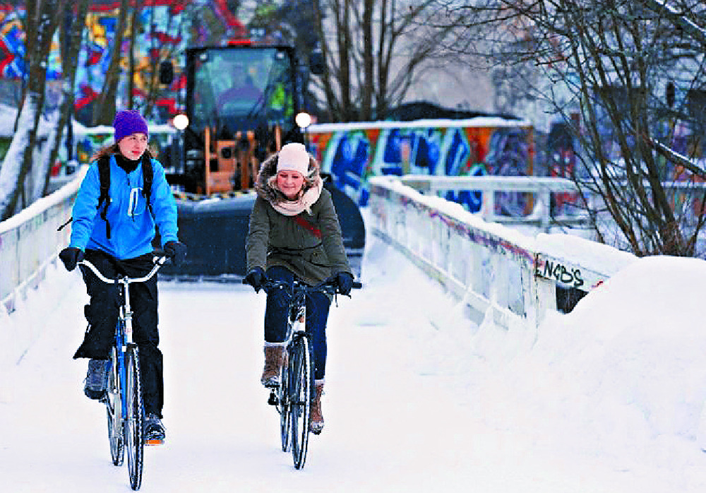

## Other Broad Research Methods Themes
- Consumer demand and welfare analysis
- Spatial econometrics
- Surrogate (meta)-models for complex simulation systems
- Decision-making under uncertainty
- System resilience

## Revealed Preferences
What we observe people doing with their time and money.

{fig-align="center" width=50%}

## Stated preferences
What people would like to be doing with their time and money.

{fig-align="center" width=50%}

## Stated Preference Experiments {.smaller}

  

## Current Applications
- Housing and neighbhourhood choice in Alberta
- Housing location choice in Singapore -  with Prateek Bansal at National University of Singapore
- Long-distance EV choice - with Sven Anders at University of Alberta
- Causal inference in chronic wasting disease and hunting location choice - with Vic Adamowicz at University of Alberta
- Child-parent treatment choice + surgeon choice - with Deborah Marshall at University of Calgary

## Workshop on Measurement and Methods in Choice Behaviour {.smaller}
- May 2-3: Workshop at Banff International Research Station (BIRS)
    - Scholars from across Canada in transportation, environment, health, marketing, and industrial organization
- May 1: Seminar on water economics with Weizhe Weng (University of Guelph)
- May 4: Seminar on travel behaviour with Adam Weiss (Carleton University) and Khandker Nurul Habib (University of Toronto)
