## Outline
1. Ontology and Epistemology
2. Home Production Theory
3. Integrated Transportation \& Land Use Models
4. Research Gaps in Data \& Models
5. Data Synthesis
6. Model Framework
7. Empirical Results
8. Current work

## Ontology: What is a city? {.smaller}
- An agglomeration of economic production

- A collection of people interacting in space

## Epistemology: How we model the city? {.smaller}
- **Urban Economics:** E.g., "Did highways cause suburbanization?" Quarterly Journal of Economics (Baum-Snow, 2007)
  - Research question typically set by researcher
  - Careful causal identification on a single research question using reduced-form OLS
  - Builds on economic theory such as Alonso, Muth, Mills (AMM) monocentric city model
- **Transportation Engineering:** E.g., "The Integrated Land Use, Transportation, Environment (ILUTE) Microsimulation Modelling System" Travel Behaviour Research (Miller \& Salvini, 2002)
  - Research question(s) typically set by planning agency
  - Microsimulation system of models to answer multiple questions
  - Builds on diverse theory such as AMM (1960s-1970s), Lowry (1960s), and Hanson (1980s)

## Ontology: The Simulated City
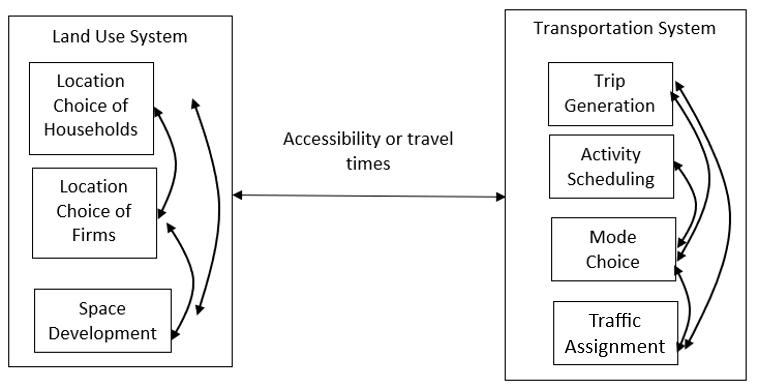

## Ontology: The Simulated Transportation System
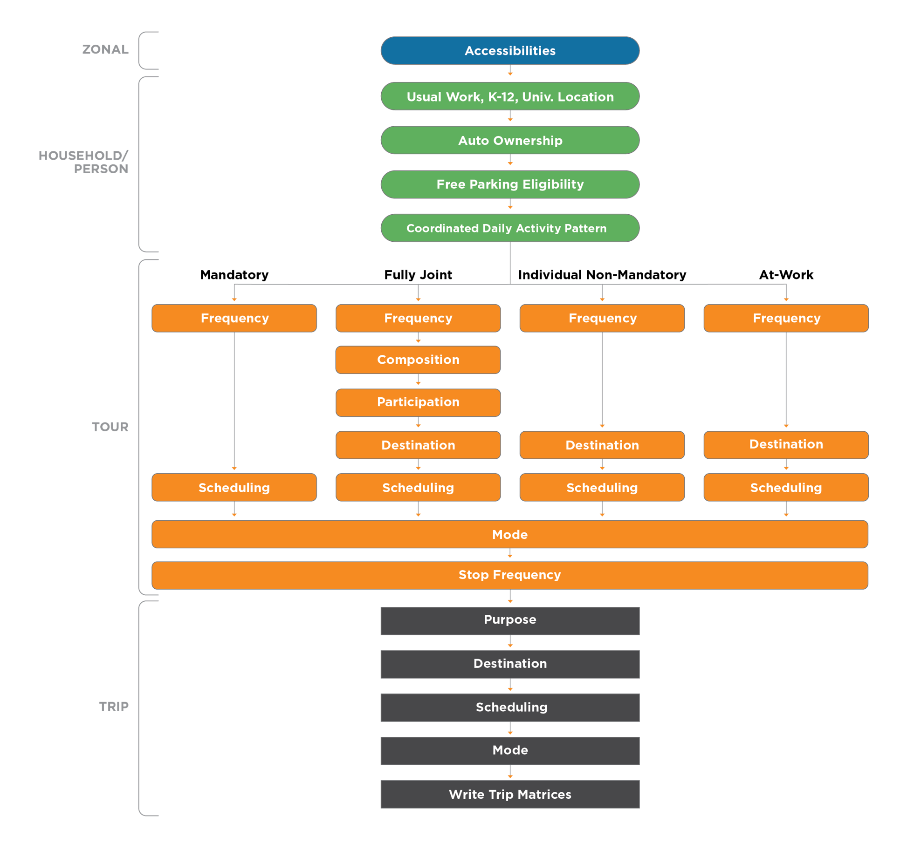

## Home Production Theory {.smaller}
- “Eco-nomics” from Greek: Oikos (“household”) and Nemein (“management”)
- Begin from model of Becker (1965): households make tradeoffs between **home production** (time allocation) & **market consumption** (money allocation)
- Forms a consistent theoretical basis for integrating transportation, land use, & macroeconomic models
- Activity-based travel models have similar theoretical lineage (through value of travel time literature of DeSepera, Evans, \& Jara-Diaz)
- How much time do I spend on activities **in the home** vs. **out of the home**?
- Do I want a **large home** with plenty of space for cooking or a **small apartment** close to a variety of restaurants?

## Scheele's Taxonomy of the Home
1. Home as a project - constantly being rebuilt and changed
2. Home as a base for daily life - a place for recreation and carrying out household routines
3. Home as an archive of memories - an integral part of life story
4. Home as a temporary station - activities mainly take place elsewhere

## Hojrup's Life-Mode
1. Self-employed life-mode: work as a means of production and the home as central to it
2. Wage-earner life-mode: work as a wage to maximize utility during leisure time
3. Career life-mode: work as a means of progress and the home as a status symbol

## Conctual Home Production Integration
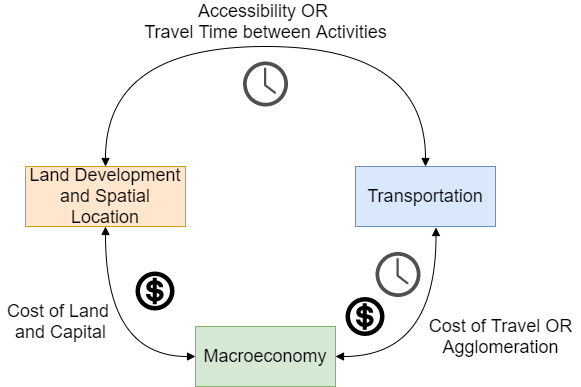

## Research Gaps {.smaller}
**Data Gaps**

- Household travel surveys do not consider in-home activities
- Expensive and challenging to collect survey data with both time use and expenditure responses (we tried it)
- Data fusion methods are ad-hoc and poorly developed

**Model Gaps**

- Only able to consider single-person households
- Do not model non-working household members
- Arbitrary definition of **consumption technology**: minimum time required to consume a good or service

## Data Synthesis 1: Overview
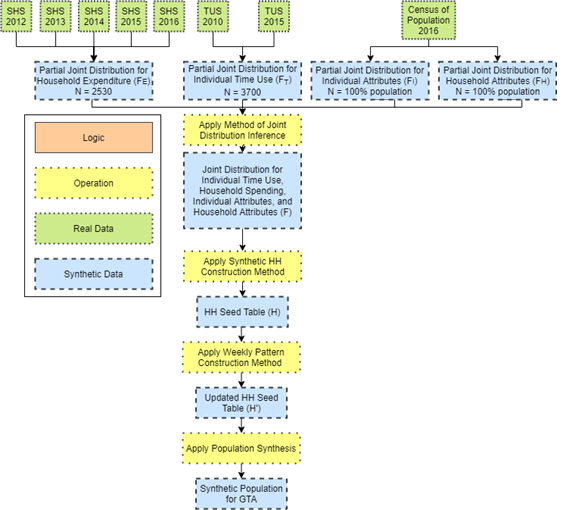

## Data Synthesis 2: Joint Distribution Inference
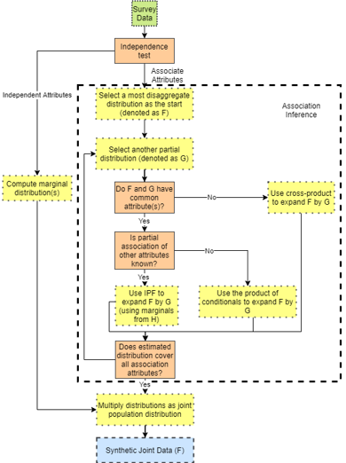

## Data Synthesis 3: Household Seed Table
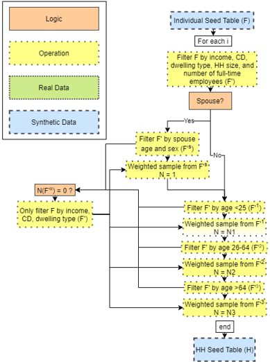

## Data Synthesis 4: Household Time Use Table
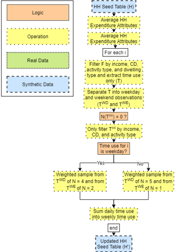

## Data Synthesis 5: Synthetic Data Table
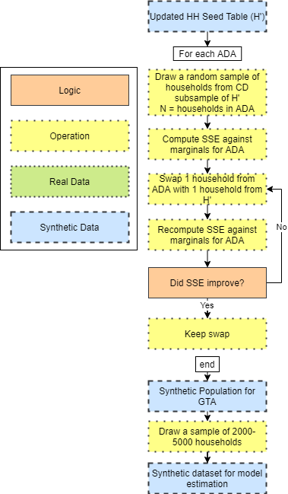

## Data Synthesis 6: Internal Validation
::: columns
::: column
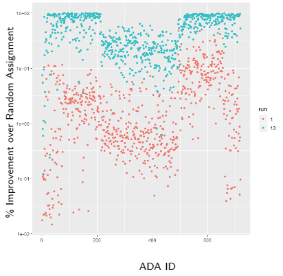{width=100%}
:::

::: column
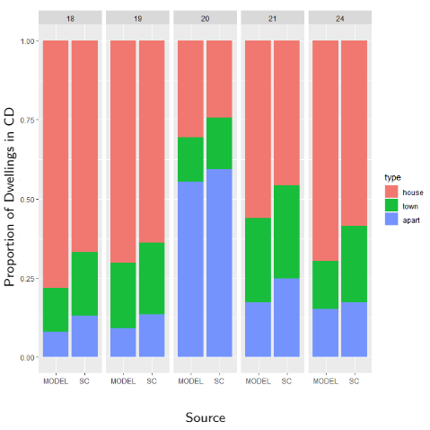{width=100%}
:::
:::

## Data Synthesis 7: External Validation
::: columns
::: column
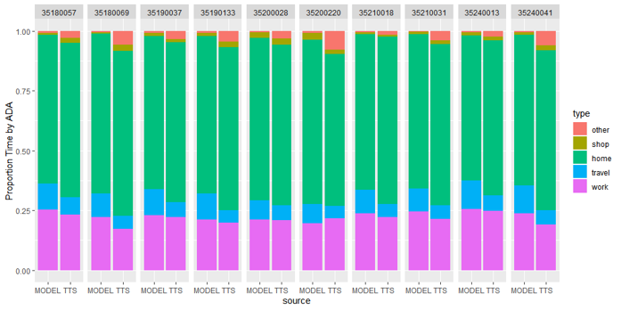{width=100%}
:::

::: column
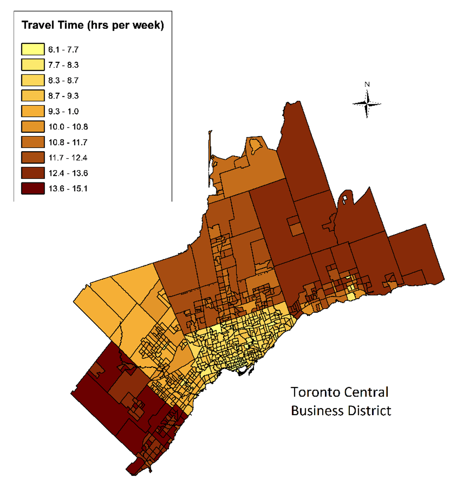{width=100%}
:::
:::

## Conceptual Full Model Framework {style="font-size: 0.6em;"}
- Assume a multiple discrete-continuous extreme value (MDCEV) model with a generalized nested logit error structure
$$F\left(\epsilon_{1}^*,(\epsilon_{12},...\epsilon_{1k}),(\epsilon_{l2},...\epsilon_{lK}),...(\epsilon_{L1},...\epsilon_{LK})\right) = \left[\exp\left(-\exp\left(\frac{-\epsilon_{1}^*}{\sigma}\right)\right)\right] \\ \prod_{l=1}^L \left[\exp -\left(\sum_{k=1}^K\exp\left(\frac{-\epsilon_{lk}}{\sigma \theta}\right)\right)^\theta \right]$$

- Maximize the objective function
$$\max(U_q(\boldsymbol{x}_{ql},\boldsymbol{t}_{ql},\boldsymbol{t}_{qlw})) = \sum_{l=1}^L\sum_{k=1}^K u_k(x_{qlk}) + \sum_{l=1}^L\sum_{n=1}^N\widetilde{u}_n(t_{qln}) + \sum_{l=1}^L\widetilde{u}_w(t_{qlw})$$

- With the following baseline utility function
$$
  \begin{align}
    &\psi_{qkl} = exp(\boldsymbol{\beta}_q' z_{qlk} + \boldsymbol{\delta}_q' x_{ql} + \epsilon_{qlk}) \\
    &\psi_{qnl} = exp(\boldsymbol{\widetilde{\beta}}_q' \widetilde{z}_{qln} + \boldsymbol{\widetilde{\delta}}_q' \widetilde{x}_{ql} + \widetilde{\epsilon}_{qln}) \\
    &\psi_{qwl} = exp(\boldsymbol{\widetilde{\beta}}_q' \widetilde{z}_{qlw} + \boldsymbol{\widetilde{\delta}}_q' \widetilde{x}_{ql} + \widetilde{\epsilon}_{qlw}) \\
  \end{align}
$$

## Empirical Home Production Model 1 {style="font-size: 0.6em;"}
- Assume a multiple discrete-continuous extreme value (MDCEV) model where utility is given by the following translated CES function (assuming $\alpha_𝑘->0$ gives LES or a variant of the Stone-Geary expenditure function)
$$U\left(\mathrm{x}\right)=\sum_{k=1}^{K}\gamma_k\psi_k\mathrm{ln}\left(\frac{x_k}{\gamma_k}+1\right)$$
- Maximize the objective function
$$\mathrm{max}\left(U_q\left(\mathbf{x}_q,\mathbf{t}_q,\mathbf{t}_{qw}\right)\right)=\sum_{k=1}^{K}u_k\left(x_{qk}\right)+\sum_{n=1}^{N}{\widetilde{u}}_n\left(t_{nq}\right)+{\widetilde{u}}_w\left(t_{wq}\right)$$
- Subject to the constraints
$$\sum_{k=1}^{K}p_{qk}x_{qk}=E_q+\omega_qt_{qw}$$
$$\sum_{n=1}^{N}t_{qn}+t_{qw}=T_q$$

## Empirical Home Production Model 2 {.smaller}
- Assume all members of a household are subject to a common monetary budget constraint & independent (for now) temporal budget constraints
- Introduce a parallel constraint (model called **PC-MDCEV**) through a change in the specification of the GEV error structure to
$$G\left(Y_{11},Y_{21},\ldots Y_{1k}\ldots Y_{1H}\ldots Y_{Hk}\right)=\sum_{b}^{B}\left[\prod_{h}^{H}\left(\sum_{k}^{K}Y_{hk}^{\lambda_b}\right)^{\theta_h^q}\right]^{1/\lambda_b}$$

- $\theta_ℎ^𝑞$ represents the contribution of individual q (household member h) to consumption by household H
- $\theta_ℎ^𝑞$ can be parameterized based on member characteristics and is identified off inter-household variations

## Empirical Home Production Model 3 {style="font-size: 0.6em;"}
- Following much simplification, the joint likelihood function for an individual q is given by
$$P_q=\left[c_{qw}\prod_{k=2}^{K}c_{qk}\sum_{k=1}^{M}\frac{1}{c_{qk}}\prod_{n=2}^{\widetilde{M}}c_{qn}\sum_{n=1}^{\widetilde{M}}\frac{1}{c_{qn}}\right]\left[\frac{{\widetilde{V}}_{qw}}{a-b}\mathrm{exp} \left({\widetilde{\mathbf{\beta}}}_q\prime{\widetilde{z}}_{qw}\right)\mathrm{exp} \left(-\frac{{\widetilde{V}}_{qw}}{a-b}\mathrm{exp} \left({\widetilde{\mathbf{\beta}}}_q\prime{\widetilde{z}}_{qw}\right)\right)\right]\\\prod_{k=1}^{M}\frac{exp\left({\theta_h^qW}_{qk}\right)}{\left(\sum_{k=1}^{K}exp\left({\theta_h^qW}_{qk}\right)\right)}\left(M-1\right)!\left[\frac{\prod_{\widetilde{M}=1}^{\widetilde{M}}\mathrm{exp}\left(W_{qn}\right)}{\sum_{n=1}^{N}\mathrm{exp}\left(W_{qn}\right)}\left(\widetilde{M}-1\right)!\right]$$
where $a=\frac{\omega_q}{x_{q1}^\ast-x_{q1}^0}$ and $b=\frac{1}{t_{q1}^\ast-t_{q1}^0}$
- We can then define
$$P_H=\prod_{h}^{H}P_{hk}^{\theta_h^q}P_{hn}$$
and parameterize contributions to the household function by individuals as
$$\theta_h^q=\frac{\mathrm{exp} \left(\beta Z_h^q\right)}{\sum_{h}^{H}\mathrm{exp}\left(\beta Z_h^q\right)}$$

## Some Notes on Budget Constraints {.smaller}
- Travel time has a negative marginal utility & does not fit with positive marginal utility assumption of MDCEV
  - Travel time removed from total travel budget
  - Model-based solutions now exist
- Time budget becomes endogenous as a function of the travel time necessary to move between activity locations (**transportation model connection**)
- Similarly, monetary budget becomes conditional upon the home purchase (**daily vs. long-term expenditure connection**)

## PC-MDCEV Model Results {style="font-size: 0.6em;"}

::: {.scrollable style="max-height: 600px; overflow-y: auto; overflow-x: auto;"}

| Variable | Work | Home Prod | Shop | IH Food | OH Food | IH Ent | OH Ent | Social | Dwell | Edu |
|:---|:---:|:---:|:---:|:---:|:---:|:---:|:---:|:---:|:---:|:---:|
| **Time Allocation** | | | | **Baseline Marginal Utility ($\beta$)** | | | | | | |
| ASC | - | 2.119 | -4.261 | 1.396 | -4.233 | -0.437 | -3.896 | 0.109 | - | -8.356 |
| Female | -0.76 | - | - | - | - | - | - | - | - | - |
| Age <25 | - | - | - | 0.357 | 0.433 | - | - | - | - | - |
| Age 25-34 | - | -0.587 | -0.291 | 0.435 | 0.502 | - | - | - | - | -0.647 |
| Age 35-44 | - | -0.253 | -0.201 | 0.451 | 0.465 | - | -0.099 | - | - | -2.187 |
| Age 45-54 | - | 0.286 | -0.370 | 0.501 | 0.531 | 0.214 | - | -0.116 | - | -2.764 |
| Age 55-64 | - | - | -0.421 | 0.656 | 0.560 | 0.457 | -0.494 | -0.395 | - | - |
| Age 65-74 | - | - | -0.348 | 0.618 | 0.528 | 0.473 | -0.186 | -0.512 | - | - |
| Work balance | -1.111 | - | - | - | - | - | - | - | - | - |
| HH size | -2.345 | -0.385 | - | - | - | - | - | - | - | - |
| Durham region | -0.582 | - | - | 0.217 | 0.506 | - | - | - | - | - |
| **Satiation ($\gamma$)** | - | 0.018 | 0.061 | 1.398 | 0.018 | 0.918 | 0.112 | 0.544 | 0.114 | 124.7 |
| | | | | | | | | | | |
| **Consumption** | | | | **Baseline Marginal Utility ($\beta$)** | | | | | | |
| ASC | - | -1.917 | - | 2.486 | -0.285 | 2.842 | 0.936 | - | 5.551 | -2.337 |
| Married | - | 0.843 | - | 1.043 | 0.659 | 0.759 | 0.595 | - | 0.947 | 0.852 |
| Divorced/Sep | - | 0.714 | - | 1.082 | 0.730 | 0.844 | 0.612 | - | 1.027 | 1.046 |
| Apt Dwelling | - | - | - | 0.758 | - | 0.485 | 0.263 | - | 0.885 | - |
| Median Income | - | - | - | - | - | - | - | - | - | 0.029 |
| **Satiation ($\gamma$)** | - | 0.005 | - | 0.024 | 0.004 | 0.017 | 0.039 | - | 0.001 | 0.006 |

:::

## Findings {.smaller}
- Members of larger households tend to spend less time on home production
  - Represents an opportunity to apply the economics of the firm to an interpretation of household behavior!
  - Larger households, like larger firms, benefit from economies of scale
- Type & mix of dwellings (detached, townhouse, apartment, etc.) have significant influences on both time use and expenditure
- Both in-home and out-of-home food consumption time tends to increase with age – younger individuals are in a rush to finish their meals?

## Current Work {.smaller}
- Sheppard (1980) critiques standard spatial choice theory
- Many spatial choices are rarely or never observed, so we specify utility *a priori* and test on cases where data available
- How much do *choices* say about *preferences* given structural constraints of capitalist system?
- Suburban locations by high income groups is explained by a relatively greater preference for open space has become standard in much of the neoclassical literature
- Implication is that the market allocates land efficiently to all people according to their
relative preferences, and that the crowding of low-income groups onto higher priced
inner-city land is similarly an outcome of their preferences
- Fundamentally, a **choice set problem**

## Current Work
- 2-stage discrete choice experiment (DCE)
- **Stage 1:** select a neighbourhood based on images - process as latent variables in model
- **Stage 2:** select a dwelling conditional on neighbourhood choice
- Track search process between neighbourhood \& dwelling level
- Provide revealed preference default option

## Current Work {.smaller}
::: columns
::: column
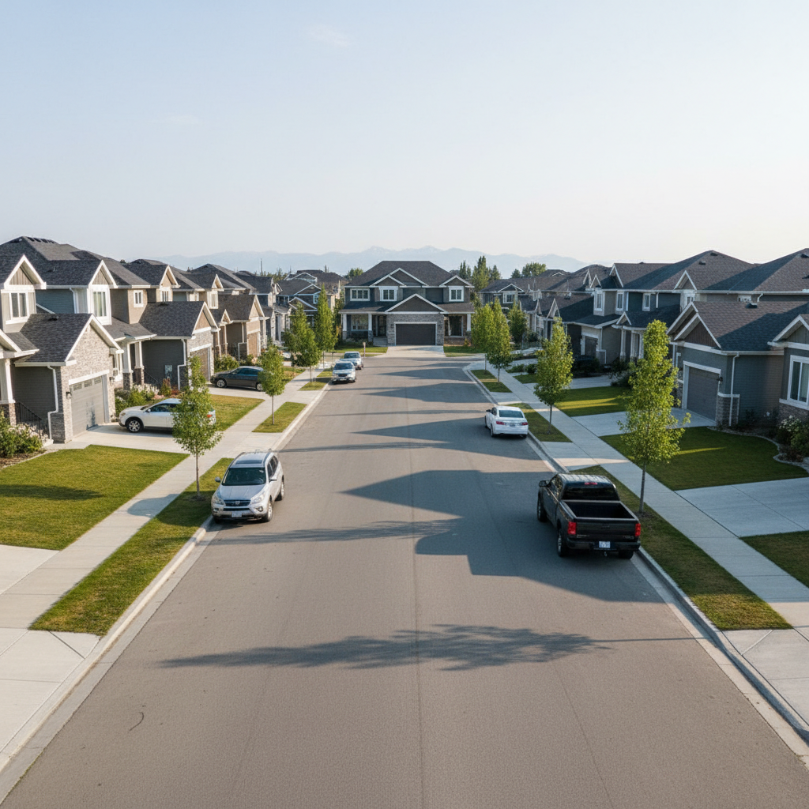{width=100%}

:::

::: column
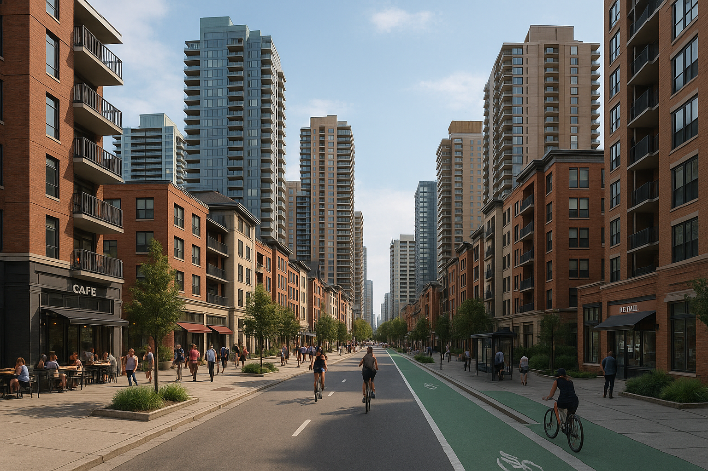{width=100%}
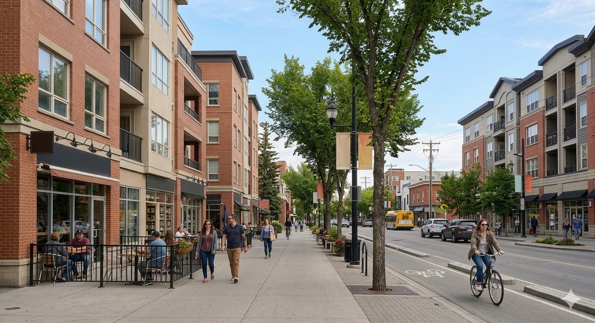{width=100%}
:::
:::

# Thank You!