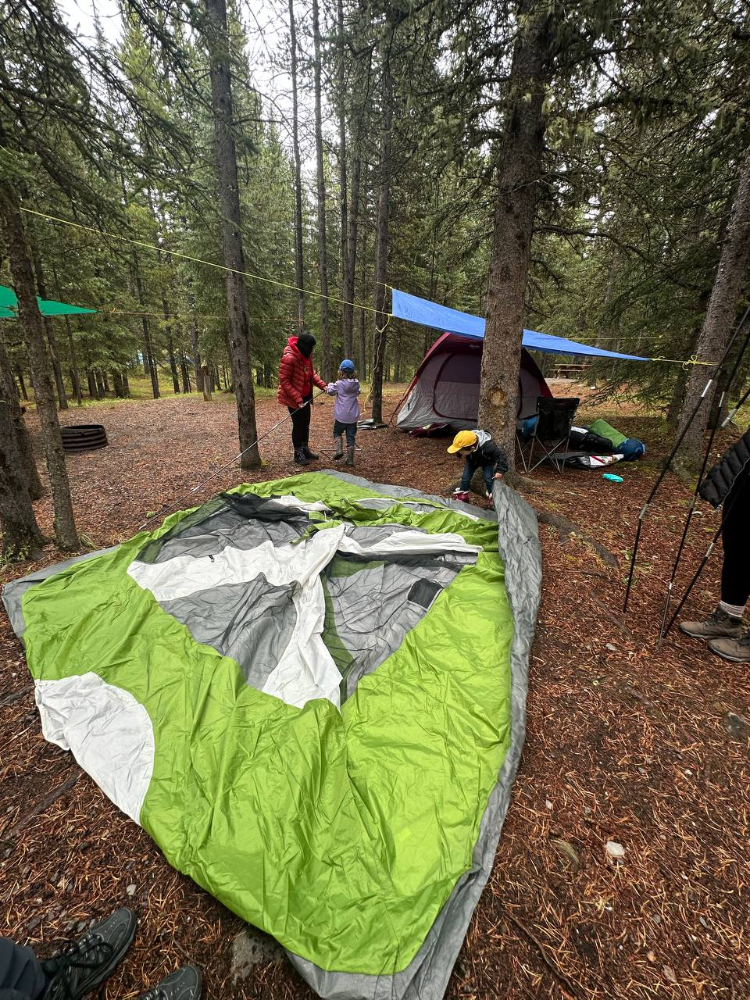
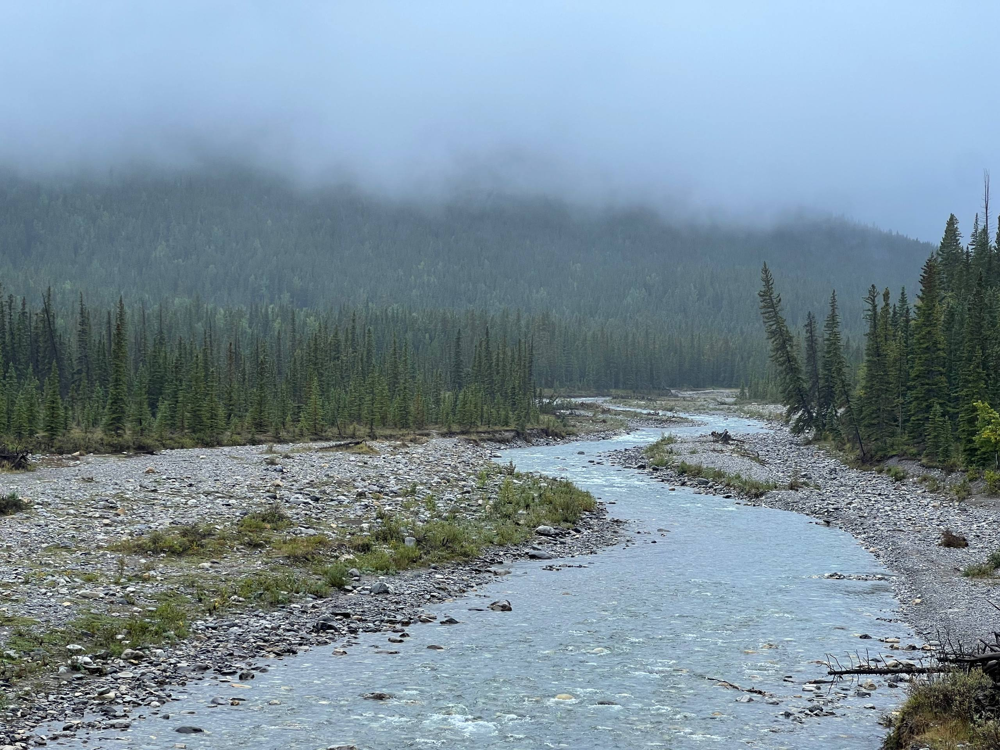
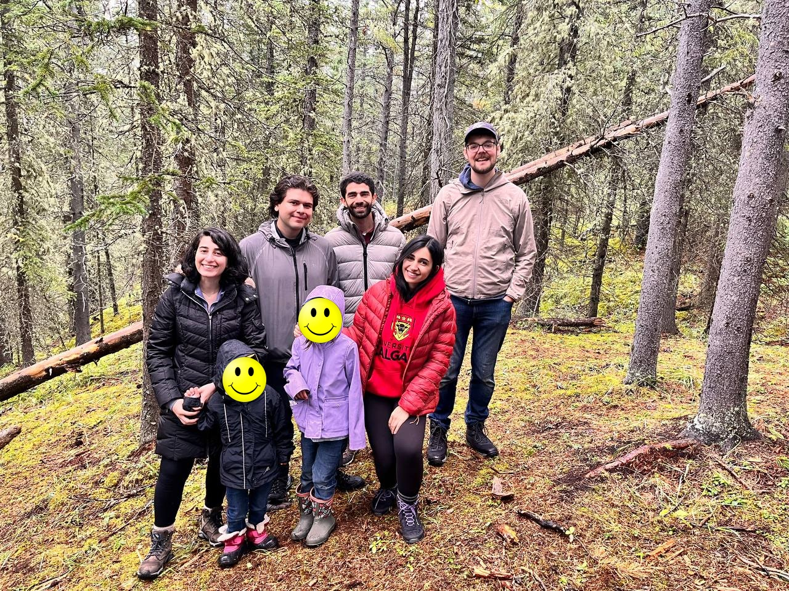

I took members of my reseach group camping this weekend. The weather was not ideal, a mix of rain and clouds, but it was an excellent night out of the city. My group predominantly studies civil systems in urban areas, so a trip to the Rocky Mountains may seem removed from our work. However, I would argue that it is central to the work when viewed through the appropriate lens. Marx talked about capitalism causing a 'metabolic rift' that disrupts the natural material exchanges and ecological cycles between humanity and the earth. Calgary is a city built on the extraction of fossil fuels from distant natural deposits, under the direction of engineers and scientists in offices (and increasingly homes) at a great spatial remove from their impacts on the landscape. At the same time, many people perceived the city as generic beyond its location near the picturesque Rocky Mountains. I beg to differ and believe there are many hidden gems within the City of Calgary limits, but that is a topic for another time.

Most of my students come from outside Canada and have no experience camping. It is a bit of a risk taking them into the mountains to spend the night. Will they enjoy it or be miserable? Will they sleep at all on a borrowed air mattress? Fortunately, we had an amazing experiene sharing in the setting up of a campsite, cooking food over a propane stove, and singing songs around the campfire. I have fortunate to have a group who, along with being excellent researchers, are also open-hearted to new experiences and playing with my kids.

It was an ideal time for me to take this trip with my research group. I recently finished 'The Economy of the Earth' by the late environmental philosoper Mark Sagoff. Sagoff gives an example from his environmental ethics course of a ski resort proposed by Walt Disney Enterprises to be located in the middle of Sequoia National Park in California. Sagoff first asked his students how many of them have visited Sequoia; few students raised their hands. He then described the proposed development and asks how many would visit; many more raised their hands that they would visit the ski resort. When Sagoff then followed up with the question of whether the resort should be built, there was unanimous agreement that it was acceptable to build the resort in the middle of a national park. He uses this story to juxtapose two roles we take as individuals: that of the 'consumer' who seeks to maximize their personal utility and that of the 'citizen' who considers societal wellbeing and moral values.

I am still working through my thoughts on Sagoff's philosophy. It seems to me he operates from a Western value system that assumes these two roles, but more importantly that we are unable to make 'consumer' choices based on the moral reasoning of the 'citizen'. Being in the mountains reinforces for me the moral imperative to protect these ecosystems for future generations (of both human and non-human residents). At the same time, it reminds me of the metabolic rift that impinges upon my work to develop more sustainable urban infrastructure and social systems. I sometimes talk with colleagues about the desire to bring residents of North American cities to European cities with high-quality transportation and land use features. If only they could see the way it can be done. In a similar way, it be great to bring the same people to Kananaskis (though many from Calgary visit) and talk about the impacts of human consumption patterns on these vital ecosystems.

While I cannot bring everyone in the world on a tour of my favourite places, I certainly have it within my control to take my research group and hope these environments imbue them with the same desire. That they also embark on a tightrope journey that balances the development of civil infrastructure systems, while shrinking the metabolic rift that exists between our industrial systems of production and finite planet. I have hope that we can see a future that is more sustainable, equitable, and aligned with natural processes, one rainy weekend camping trip at a time.

