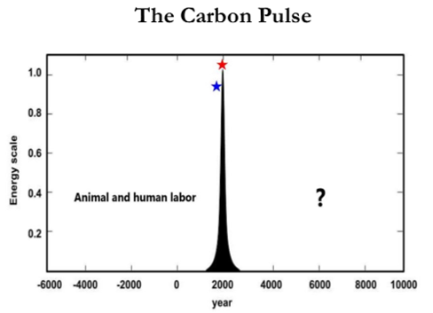
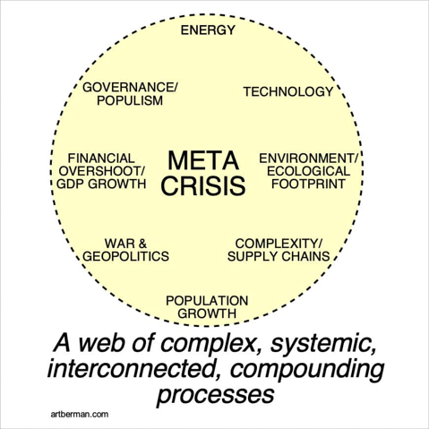

# Defining Complex Civilization
Joseph Tainter defines collapse as "a rapid, significant loss of an established level of sociopolitical complexity". This definition relies on a society maintaining a level of complexity over generations and the loss must be rapid (over a few decades). It is a complex process to define and identify in history. Consider the case of Rome, which declined over a period of a few decades but also saw a shift to the east (Rome to Constantinople). One could argue that Rome did not collapse; rather, it simply declined and shifted its center of gravity.

Likewise, Tainter defines civilizational complexity based on its size, hierarchy, and complex. Luke Kemp in "Goliath's Curse" and David Graeber/Wengrow in "The Dawn of Everything" make counter arguments that hierarchy is a function of dominance and is not necessary for complex civilization. My view is somewhere in the middle. Current civilization, as documnented by Thomas Piketty in "Capital in the 21st Century", is too hierarchical and uneven. However, there is a need for hierarchy and heterogeneity in that individuals must necesessary hold different roles that lead to stratification and hierarchy - I advise graduate students and teach undergraduate students; the Prime Minister is the leader of Canada; and income should increase with experience and responsibility (though not as steeply as in many settings).

Another dimension of complexity is attributed to Robert Boyd, as discussed in "A Different Kind of Animal". Boyd describes the human ability to weigh imitation and environmental responses. Imitation is the copying of social patterns across generations, which Boyd frames around culture as an evolutionary force. Environmental response is the adaptation by individuals to current conditions. If individuals rely more heavily on imitation, the population will track environmental change less closely. In the face of climate change, I argue that there is a need to re-evaluate this balance, shifting it increasingly towards adaptation to environmental responses rather than imitation of the cultural norms we inherited from previous generations. Conversely, I agree with Boyd that the collective brainpower enabled by our propensity for imitation means that culture allows large populations of humans to acquire and pool local adaptations to invent solutions to global challenges. Paraphrasing the words of the ecologist E.O. Wilson, the problem we must solve is how to align our paleolithic emotions and imitation of millions of generations of ancestors with the speed of environmental change induced by our god-like technology, given the signals and structures provided by our medieval institutions.

# Measuring Civilizational Progress

Ian Morris defines a measure of social progress based on energy capture, organizational capacity, information processing capability, and military power. The choice of metrics is strongly influenced by one's worldview and definition of progress. We can reference the work of XXX on the limitations of ordered quantification.... Energy capture begins from a value statement that can be connected to Howard T. Odum's definition of the maximimum power principle - that systems seek out the maximum power (i.e., input energy per unit time) and not necessary the maximum efficiency alternative. The unspoken assumption is that energy capture (and therefore consumption) is an objective good. Information processing capabability is measured based on written communcation. Of course, some civilizations (notably the Incan use of quipu, or knotted strings, for recording keeping) had no formal system of writing to represent abstract concepts.

We respond to what we measure. While the Morris Score of Social Development is a useful framework for tracking change over time, it is firmly rooted in a Western value system. In the same way that Kate Raworth, in "Doughnut Economics", critiques the reliance on GDP growth as a measure of progress or decline, civilizational metrics are prone to definitional bias. Collapse as measured by Morris' social development or Kuznets' GDP are simply one a slice of civilizational status that obfuscates all complexity. If we change our metrics, collapse may represent a reorientation in response to constraints imposed by environmental or social forces. I will expand on this theme in the following two sections.

# Energy capture and the carbon pulse
Our current fossil fuel-based energy system is a marvel. As energy market analyst Andrew Nikiforuk terms them, we have access to an army of "energy slaves". Depending upon the price of oil, we would require 7,000-26,000 humans (working 24/7) to replace the energy from a barrel of oil. Andreas Malm provides an excellent history of the shift from human and flow-based energy to stock-based energy. A stock is by its nature finite and depletable. He makes the argument that energy capture transitioned during the Industrial Revolution from flow-based (i.e., water and wind) to stock-based (i.e., fossil fuels) energy. Flow-based energy is constrained in its location by access to waterways, whereas stock-based energy may be moved and accumulated as a stock. This feature gives rise to the capitalist capture of the means of production (i.e, fossil fuels). Marx describes the process of divorcing the worker from the means of production in Theory of Surplus Value - energy can be concentrated under one roof and its ownership separated from labour. I'll have more to say on this topic, as well as Malm's discussion of concrete and abstract time, in future posts.

Turning back to Morris' social development score, its energy capture component parallels the recent argument (made by Nate Hagens and others) that we are currently living in a carbon pulse - a short-term period in which we are extracting fossil fuel energy stocks at unprecidented and unsustainable rates. Over the span of a 200 years, we have extracted millions of years of stored carbon-based fossil fuels. It presents a bleak outlook, but I argue this is only true if we employ a capitalist set of metrics. When viewed through the lens of GPD and consumption, we will see a massive shift. Viewing the carbon pulse through the lens of inclusive wealth and wellbeing can offer a more positive prospect. A "Great Simplification" (again using Hagens term), offers the opportunity for simplified lifestyles within planetary boundaries. If we must move from 250 sqm (2700 sqft) homes to 110 sqm (1190 sqft) homes, does it necessarily mean a reduction in quality of life? Or might it mean a more intimate family and community life of greater social cohesion and shared spaces?

# Meta Crisis and Carbon Tunnel Vision
When examining what leads to the rise and fall of civilizations, the conclusion we can draw is that the factors are numerous. No one factor describes the pattern across all civilizations. Nor will any one factor lead to the fall of our current global civilization. One conclusion that can be drawn is that our analyses should increasingly take a wide boundary perspective. Many in the environmental sphere, and in response those working in the energy sector, have become fixated on carbon emissions as a metric to track. In the same way that Morris' social score is an oversimplification, we must also not become stuck in "carbon tunnel vision".

Recognizing the complexity of the current global crises, Daniel Schmachtenberger has called the situation a "meta crisis". This crisis includes environmental dimensions such as carbon emissions and climate change. It includes global geopolitics and war. It also includes popularism and technology. Yes, these are all important to consider and plan for a future characterized by greater constraints across each dimension. But we must also remember that these individual crises exist within an interconnected web of complexity. Given our inability to characterize the rise and fall of historical complex civilizations, how much more will we struggle to do the same for our increasingly complex and global civilization? We must move forward with humility, caution, collaboration, but also optimism that we can accomplish great things. History tells us we have done it countless times before!

